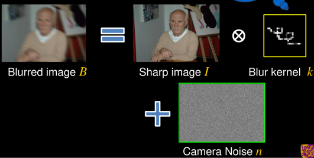
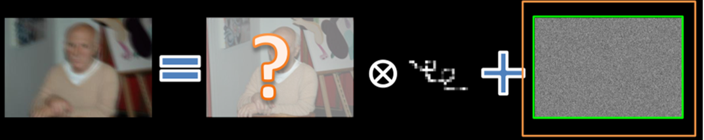
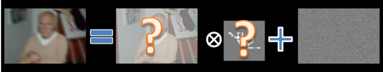

---
bibliography:
    - reference.bib
csl:
    - chinese-chemical-letters.csl
title: '图像局部去模糊方法'
link-citations: true
lang: en-GB
figPrefix:
    - Fig.
    - Figs.
linkReferences: true
pagesize: a4
'coloring''s': true
links-as-notes: true
---  

#### 图像局部去模糊

* 图像局部去模糊是一种对图像进行清晰化的处理方法，其主要目的是去除图像中的模糊或者增强图像的清晰度。以下是几种常见的图像局部去模糊的处理方法：
    
    + 双边滤波（Bilateral Filtering）：双边滤波是一种非线性滤波方法，能够在保持图像边缘的同时去除噪声。它基于图像中像素之间的相似性和距离，在去除噪声的同时保留了图像的细节信息。   
    
    + 傅里叶变换（FFT）：傅里叶变换是一种将信号从时域变换到频域的方法，可用于对图像进行去模糊处理。该方法能够提取图像中的高频信息，从而恢复模糊的细节。
    
    + 统计学方法：统计学方法可以利用图像的概率分布特性，对模糊进行建模，并对图像进行去模糊处理。该方法适用于对大面积均匀模糊的图像进行处理。

    + 深度学习方法：深度学习方法可以通过训练神经网络来实现图像去模糊处理。该方法通常需要大量的训练数据和计算资源，但可以在更高的精度和效率下处理图像模糊问题。

* 总之，不同的图像局部去模糊处理方法都有其优点和适用范围。在实际应用中，需要根据图像的特点和处理要求来选择最适合的处理方法。

#### 挑战

##### 挑战一

* 图像去模糊技术目前面临的一个重要问题，主要涉及到如何准确建模复杂的模糊场景。以下是一些解决这个挑战的方法：

    + 非线性模型建模：针对复杂模糊场景，可以考虑使用非线性模型来建模成像过程。例如，可以使用自适应非线性滤波方法来处理非均匀模糊问题，或者使用光流方法来处理动态场景下的模糊问题。

    + 深度学习模型：近年来，深度学习模型已经成为图像去模糊领域的研究热点。深度学习模型可以自动从数据中学习复杂的模糊场景，并生成高质量的清晰图像。例如，可以使用基于深度卷积神经网络（CNN）的图像去模糊方法，它们可以利用大量的有标注数据来训练模型，以生成高质量的清晰图像。

    + 图像先验知识：在模糊场景的建模过程中，还可以利用图像的先验知识来帮助改善模糊复原的效果。例如，可以使用稀疏表示方法来利用图像在某些变换域上的稀疏性质，或者使用图像的统计特征来减少噪声影响，以提高图像复原的质量。

* 综上所述，要解决图像去模糊领域的挑战，需要综合运用多种方法，包括非线性模型建模、深度学习模型和图像先验知识等，以提高图像复原的精度和效率。

##### 挑战二

* 当前图像去模糊技术面临的挑战之一，主要涉及到如何获得大量高质量的清晰图像-模糊图像对，以用于模型的训练和优化。为了解决这个问题，研究人员提出了一些方法，如以下所示：

    + 合成数据：使用图像合成技术来生成一些虚拟的清晰图像-模糊图像对，以扩充现有的数据集。这种方法虽然可以解决数据稀缺问题，但是生成的数据可能无法完全覆盖真实场景下的各种模糊情况，从而影响模型的泛化性能。

    + 无监督学习：使用无监督学习方法来训练模型，以避免对清晰图像-模糊图像对的依赖。无监督学习可以从未标注的数据中学习模型，以生成清晰图像或模糊图像。但是，无监督学习方法通常需要更长的训练时间和更复杂的模型设计。

    + 迁移学习：使用迁移学习方法将已经训练好的模型从特定场景迁移到通用场景中。迁移学习可以利用预训练模型的知识来加速新模型的训练，并减少需要的训练数据量。这种方法可以提高模型在通用场景中的泛化性能，但需要大量数据和计算资源来完成训练。

* 综上所述，图像去模糊领域面临的挑战包括如何获取大量高质量的清晰图像-模糊图像对和如何提高模型的泛化能力。为了解决这些挑战，研究人员正在探索一些方法，如使用合成数据、无监督学习和迁移学习等。

##### 挑战三

* 图像局部去模糊的处理方法中，相关的算法复杂度一般都较高，不适合端侧轻量化部署。

    + 当前一些高效的图像去模糊算法，如基于非局部均值（Non-local Means, NL-means）和双边滤波（Bilateral Filtering）等算法，虽然在图像复原效果方面有不错的表现，但是它们的计算复杂度相对较高，不太适合于端侧轻量化部署。
    
    + 因此，一些研究者提出了  一些轻量化的图像去模糊算法，如基于快速傅里叶变换（FFT）的方法、基于快速加权迭代算法（Fast Weighted Iterative Algorithm, FWIA）的方法等，这些方法虽然在一定程度上降低了算法复杂度，但是图像复原效果可能有所折损。因此，在实际应用中需要根据具体情况选择合适的算法。

#### 图像局部去模糊的发展历程

* 图像去模糊是一项重要的图像处理任务，其目的是去除图像中由于相机晃动或者物体运动等原因造成的模糊。随着计算机技术的发展，图像去模糊方法也在不断地进步和发展。这些技术都有一个共同的目标，即从一盲个或几个相应的模糊图像中推断出一个潜在的锐利图像，而去模糊技术也需要得到一个准确的模糊核。

* 传统方法：从20世纪60年代开始，去模糊方法是基于频域滤波的方法，比如退化函数的逆滤波 @yamada_image_2006 和维纳滤波等。这些方法虽然可以较好地还原一些简单的模糊情况，但在复杂的模糊场景下效果不佳，因为基于频域的图像去模糊算法需要准确的知道模糊的退化类型 @li_survey_2022 。因此提出了一些基于空间域的图像去模糊从估计算法，常见的基于空间域的估计算法有：差分恢复算法、最小二乘法、最大熵算法等等。
    + 早期研究的一些方法大多基于跟随模糊模型(Following blur model)，如figure 1所示：$$\mathbf{B} = \mathbf{K}\mathbf{S} + \mathbf{n}$$
    
    + $\mathbf{B}$为向量化模糊图像；
 
    + $\mathbf{S}$为潜在锐像；

    + $\mathbf{n}$为噪声。 
    
    + $\mathbf{K}$是模糊核，它是一个大的稀疏矩阵，它的每一行都包含一个局部模型核，作用于S一生成一个模糊像素。同样，这里可以理解为*退化函数*，通常来说模糊图像可以概括为锐化图像，经过退化函数作用后，再附加上随机噪声，最后输出为模糊图像。常见的退化类型有运动模糊、高斯模糊、离焦模糊、湍流模糊等。
  + 根据模糊核在是否已知可以分为非盲去模糊（已知$\mathbf{B}$估计$\mathbf{K}$和$\mathbf{S}$）和盲去模糊（已知$\mathbf{B}$和$\mathbf{K}$估计$\mathbf{S}$），如figure2所示。在实践中，模糊核$\mathbf{K}$是未知的。
    + 

Figure 1 Following blur model
</right>

    + 

Figure 2 Non-blind
</right>

    
    + 

Figure 3 Blind
</right>

    + 早期经典方法的缺陷是无法利用自然图像的先验信息，因此恢复后的图像精度不高，主要用于非盲图像的去模糊。

* 基于偏微分方程（PDE）的方法：PDE是一类可以描述动态系统的数学方程，可以用来描述图像的动态变化。基于PDE的图像去模糊方法可以克服一些传统方法的局限性，但其计算量很大，不适合处理大规模图像。

* 基于统计学习的方法：随着机器学习的发展，越来越多的研究者开始将机器学习方法应用于图像去模糊任务中。其中，基于稀疏表示和低秩约束的方法成为研究热点，比如基于K-SVD的方法和基于非负矩阵分解的方法等。这些方法不仅可以有效地去除图像中的模糊，还可以处理复杂的图像情况。

* 基于深度学习的方法：近年来，深度学习技术的快速发展，使得其在图像去模糊任务中也得到了广泛的应用。其中，基于卷积神经网络（CNN）的方法已成为主流，比如SRCNN、VDSR、ResNet等。这些方法不仅具有较高的去模糊效果，而且可以大大提高计算速度，适合实时应用。

* 总之，图像去模糊方法的发展经历了从经典方法到基于PDE的方法，再到基于统计学习和深度学习的方法的演进过程，未来还会继续探索更加高效、准确的图像去模糊方法。

#### Reference