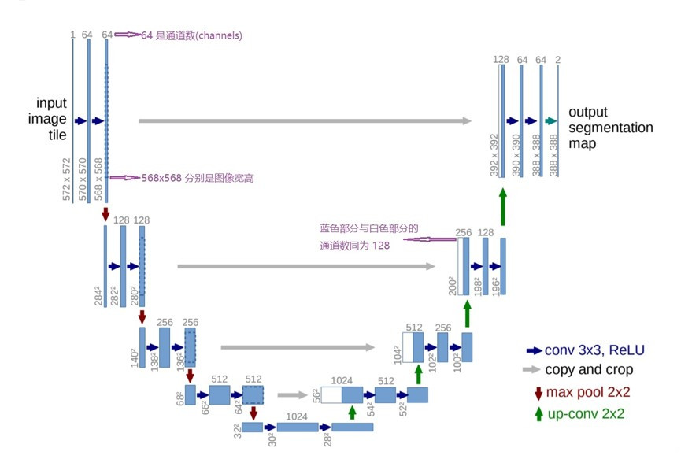
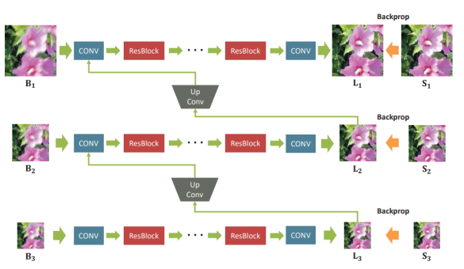
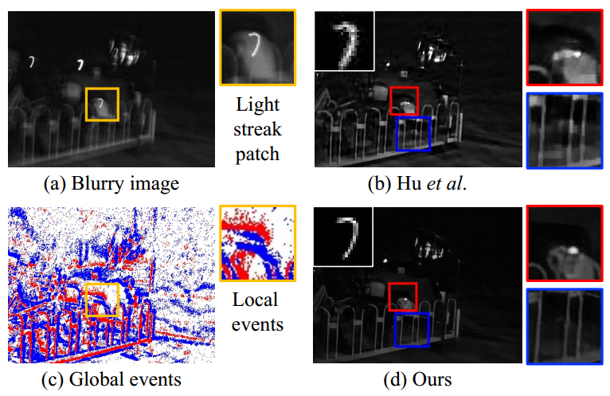

---
bibliography:
    - reference.bib
csl:
    - chinese-chemical-letters.csl
title: '图像局部去模糊方法'
link-citations: true
lang: en-GB
figPrefix:
    - Fig.
    - Figs.
linkReferences: true
pagesize: a4
'coloring''s': true
links-as-notes: true
---  

#### 图像局部去模糊

* 图像局部去模糊是一种对图像进行清晰化的处理方法，其主要目的是去除图像中的模糊或者增强图像的清晰度。以下是几种常见的图像局部去模糊的处理方法：
    
    + 双边滤波`(Bilateral Filtering)`：双边滤波是一种非线性滤波方法，能够在保持图像边缘的同时去除噪声。它基于图像中像素之间的相似性和距离，在去除噪声的同时保留了图像的细节信息。   
    
    + 傅里叶变换`(FFT)`：傅里叶变换是一种将信号从时域变换到频域的方法，可用于对图像进行去模糊处理。该方法能够提取图像中的高频信息，从而恢复模糊的细节。
    
    + 统计学方法：统计学方法可以利用图像的概率分布特性，对模糊进行建模，并对图像进行去模糊处理。该方法适用于对大面积均匀模糊的图像进行处理。

    + 深度学习方法：深度学习方法可以通过训练神经网络来实现图像去模糊处理。该方法通常需要大量的训练数据和计算资源，但可以在更高的精度和效率下处理图像模糊问题。

* 总之，不同的图像局部去模糊处理方法都有其优点和适用范围。在实际应用中，需要根据图像的特点和处理要求来选择最适合的处理方法。

#### 挑战

##### 挑战一

* 图像去模糊技术目前面临的一个重要问题，主要涉及到如何准确建模复杂的模糊场景。以下是一些解决这个挑战的方法：

    + 非线性模型建模：针对复杂模糊场景，可以考虑使用非线性模型来建模成像过程。例如，可以使用自适应非线性滤波方法来处理非均匀模糊问题，或者使用光流方法来处理动态场景下的模糊问题。

    + 深度学习模型：近年来，深度学习模型已经成为图像去模糊领域的研究热点。深度学习模型可以自动从数据中学习复杂的模糊场景，并生成高质量的清晰图像。例如，可以使用基于深度卷积神经网络`(CNN)`的图像去模糊方法，它们可以利用大量的有标注数据来训练模型，以生成高质量的清晰图像。

    + 图像先验知识：在模糊场景的建模过程中，还可以利用图像的先验知识来帮助改善模糊复原的效果。例如，可以使用稀疏表示方法来利用图像在某些变换域上的稀疏性质，或者使用图像的统计特征来减少噪声影响，以提高图像复原的质量。

* 综上所述，要解决图像去模糊领域的挑战，需要综合运用多种方法，包括非线性模型建模、深度学习模型和图像先验知识等，以提高图像复原的精度和效率。

##### 挑战二

* 当前图像去模糊技术面临的挑战之一，主要涉及到如何获得大量高质量的清晰图像-模糊图像对，以用于模型的训练和优化。为了解决这个问题，研究人员提出了一些方法，如以下所示：

    + 合成数据：使用图像合成技术来生成一些虚拟的清晰图像-模糊图像对，以扩充现有的数据集。这种方法虽然可以解决数据稀缺问题，但是生成的数据可能无法完全覆盖真实场景下的各种模糊情况，从而影响模型的泛化性能。

    + 无监督学习：使用无监督学习方法来训练模型，以避免对清晰图像-模糊图像对的依赖。无监督学习可以从未标注的数据中学习模型，以生成清晰图像或模糊图像。但是，无监督学习方法通常需要更长的训练时间和更复杂的模型设计。

    + 迁移学习：使用迁移学习方法将已经训练好的模型从特定场景迁移到通用场景中。迁移学习可以利用预训练模型的知识来加速新模型的训练，并减少需要的训练数据量。这种方法可以提高模型在通用场景中的泛化性能，但需要大量数据和计算资源来完成训练。

* 综上所述，图像去模糊领域面临的挑战包括如何获取大量高质量的清晰图像-模糊图像对和如何提高模型的泛化能力。为了解决这些挑战，研究人员正在探索一些方法，如使用合成数据、无监督学习和迁移学习等。

##### 挑战三

* 图像局部去模糊的处理方法中，相关的算法复杂度一般都较高，不适合端侧轻量化部署。

    + 当前一些高效的图像去模糊算法，如基于非局部均值`(Non-local Means, NL-means)`和双边滤波`(Bilateral Filtering)`等算法，虽然在图像复原效果方面有不错的表现，但是它们的计算复杂度相对较高，不太适合于端侧轻量化部署。
    
    + 因此，一些研究者提出了  一些轻量化的图像去模糊算法，如基于快速傅里叶变换`(FFT)`的方法、基于快速加权迭代算法`(Fast Weighted Iterative Algorithm, FWIA)`的方法等，这些方法虽然在一定程度上降低了算法复杂度，但是图像复原效果可能有所折损。因此，在实际应用中需要根据具体情况选择合适的算法。

#### 图像局部去模糊的发展历程

* 图像去模糊是一项重要的图像处理任务，其目的是去除图像中由于相机晃动或者物体运动等原因造成的模糊。随着计算机技术的发展，图像去模糊方法也在不断地进步和发展。这些技术都有一个共同的目标，即从一盲个或几个相应的模糊图像中推断出一个潜在的锐利图像，而去模糊技术也需要得到一个准确的模糊核。去模糊技术发展的分类如下图法figure 1。

    

Figure 1 去模糊算法分类
</right>

##### 按方法分类

* 传统方法：从20世纪60年代开始，去模糊方法是基于频域滤波的方法，比如退化函数的逆滤波 @yamada_image_2006 和维纳滤波等。这些方法虽然可以较好地还原一些简单的模糊情况，但在复杂的模糊场景下效果不佳，因为基于频域的图像去模糊算法需要准确的知道模糊的退化类型 @li_survey_2022 。因此提出了一些基于空间域的图像去模糊从估计算法，常见的基于空间域的估计算法有：差分恢复算法、最小二乘法、最大熵算法等等。
    + 早期研究的一些方法大多基于跟随模糊模型`(Following blur model)`，如figure 2所示：$$\mathbf{B} = \mathbf{K}\mathbf{S} + \mathbf{n}$$
    
    + $\mathbf{B}$为向量化模糊图像；
 
    + $\mathbf{S}$为潜在锐像；

    + $\mathbf{n}$为噪声。 
    
    + $\mathbf{K}$是模糊核，它是一个大的稀疏矩阵，它的每一行都包含一个局部模型核，作用于S一生成一个模糊像素。同样，这里可以理解为*退化函数*，通常来说模糊图像可以概括为锐化图像，经过退化函数作用后，再附加上随机噪声，最后输出为模糊图像。常见的退化类型有运动模糊、高斯模糊、离焦模糊、湍流模糊等。

  + 根据模糊核在是否已知可以分为非盲去模糊（已知$\mathbf{B}$估计$\mathbf{K}$和$\mathbf{S}$）和盲去模糊（已知$\mathbf{B}$和$\mathbf{K}$估计$\mathbf{S}$），如figure 3和figure 4所示。在实践中，模糊核$\mathbf{K}$是未知的。

    + 

Figure 2 Following blur model
</right>

    + 

Figure 3 Non-blind
</right>

    
    + 

Figure 4 Blind
</right>

    + 早期经典方法的缺陷是无法利用自然图像的先验信息，因此恢复后的图像精度不高，主要用于非盲图像的去模糊。

* 基于偏微分方程（PDE）的方法：PDE是一类可以描述动态系统的数学方程，可以用来描述图像的动态变化。基于PDE的图像去模糊方法可以克服一些传统方法的局限性，但其计算量很大，不适合处理大规模图像。

* 基于统计学习的方法：随着机器学习的发展，越来越多的研究者开始将机器学习方法应用于图像去模糊任务中。其中，基于稀疏表示和低秩约束的方法成为研究热点，比如基于K-SVD的方法和基于非负矩阵分解的方法等。这些方法不仅可以有效地去除图像中的模糊，还可以处理复杂的图像情况。
    + **基于最大后验概率的图像去模糊算法**的核心思想是找到某个解（清晰图像），使得其后验概率值最大。即为在已知退化图像$y$的条件下，找到一组清晰图像$x$和模糊核$k$，使得概率$P\left( y|x,k \right)$最大，其数学表示为$$\hat{x}, \hat{k} = \arg \min_{x,k} P(y|x, k)$$根据贝叶斯公式，可将上式转化为$$\hat{x}, \hat{k} = \arg \min_{x,k}P(x,k|y) \ P(x) \ P(k)$$其中，$P(x,k|y)$为似然概率，其概率分布即为噪声$n$的分布。$P(x)$和$P(k)$分别为清晰图像$x$和模糊核$k$的先验概率。
    根据$MAP$框架建模的方式不同，去模糊算法可以分为两类：基于稀疏先验的图像去模糊算法，修改数据项的图像去模糊算法。
    + **基于稀疏先验的图像去模糊算法**：基于MAP的先验算法是通过修改MAP框架的先验项来克服图像去模糊的病态问题，从而复原出清晰图像。在通常情况下，该类方法建立在线性退化模型的基础上，假设噪声服从高斯分布，并且其均值为$0$方差为$\sigma$。而图像的先验概率和模糊核的先验概率分别为$P(x) \varpropto e^{-\rho(x)}, P(k) \varpropto e^{- \rho(k)}$则可以得到基于最大后验概率的图像去模糊框架为$$\hat{x},\hat{k}=\arg\min_{x,k} {\Vert k \otimes x - y \Vert}^2_2  + \lambda_1 \rho(k)+\lambda_2 \rho(x)$$其中，$\lambda_1 \rho(k)+\lambda_2 \rho(x)$分别为图像的先验概率。特别地，这里的框架是一种盲目反卷积框架，对于非盲目反卷积同样具有类似的框架，$$\hat{x}=\arg\min_{x,k} {\Vert k \otimes x - y \Vert}^2_2  + \lambda_1 \rho(k)$$该类方法就是要通过设计$\rho(k)$和$\rho(x)$，实现约束病态问题具有可逆的过程并最终收敛至清晰图像。

    + **基于变分贝叶斯框架的去模糊算法**：基于变分贝叶斯的图像去模糊算法的核心思想是考虑所有可能的解，所以理论上是更稳健的。Fergus使用混合高斯模型通过贝叶斯推断学习一个梯度先验，Levin提出这种基于贝叶斯推断的方法可以避免MAP问题中出现的趋向于平凡解的问题。但由于需要遍历整个解空间，算法的速度太慢，无法达到实用的要求。

    + **基于边缘估计的去模糊算法**：基于边缘估计的盲目反卷积算法的核心思想是通过一些滤波、图像增强等算法显式地估计出具有大尺度边缘、细小边缘被抑制的图像，然后基于这些显著边缘来估计模糊核。基于边缘估计的去模糊算法速度快并且已经证明在实际应用中非常有效，但是很难去分析，因为并不是基于模型通过优化得到，而是通过一些启发式的步骤的组合得到。
      + 基于边缘估计的盲目反卷积算法能够成功估计出模糊核的原因是其能够估计出图像中的大尺度边缘，抑制细小的边缘。文献中指出大尺度边缘更利于真实模糊核的估计，而细小的边缘起着相反的作用。文中采用双边滤波器提取图像的大尺度边缘，将提取的边缘图像用于模糊核估计。算法流程如图figure 5所示.
        

Figure 5 去模糊过程
</right>

* 基于深度学习的方法：近年来，深度学习技术的快速发展，使得其在图像去模糊任务中也得到了广泛的应用。其中，基于卷积神经网络（CNN）的方法已成为主流，比如`SRCNN`、`VDSR`、`ResNet`等。这些方法不仅具有较高的去模糊效果，而且可以大大提高计算速度，适合实时应用。
  
  + **基于深度卷积神经网络的图像去模糊方法**`(Deep Convolutional Neural Network，DCNN)`
    
    + 在非盲环境下对模糊图像进行去模糊，通过建立一个基于可分离核属性的网络，即(逆)模糊核可以分解成少量的有效滤波器。此外，还可以加入去噪模块 @eigen_restoring_2013 ，通过将模块连接到网络的末端来减少噪声和颜色饱和度等视觉伪影 @xu_deep_2014 。

      + 在图像去模糊领域中，去噪网络或者说去噪模块是指用于消除图像中的噪声的网络或模块。它们可以通过各种方法来实现，例如滤波器方法和深度学习方法。

      + **去噪网络**：去噪网络是一种用于消除图像中的噪声的深度学习网络。它们通过学习大量带有噪声和无噪声图像对来训练，以便能够从带有噪声的图像中恢复出清晰的图像。这些网络通常包括多个卷积层和非线性激活函数，以及其他组件，如批量归一化层和池化层。它们可以处理各种类型的噪声，包括高斯噪声、椒盐噪声和泊松噪声等。去噪网络一般可以分为*基于降噪自编码器*和*基于卷积神经网络*两种类型。

        + `MLP(Multilayer Perceptron)`是多层感知机，也叫人工神经网络`(Artificial Neural Network)`。除了输入输出层，它中间可以有多个隐层。最简单的`MLP`只含一个隐层，即三层的结构。多层感知机层与层之间是全连接的。
        
        + 

Figure 6 Pseudo inverse kernel and dedconvolution examples
</right>

    
      + **伪逆内核**：假设线性模糊模型为：$y=x \otimes k$；空间卷积可以转化为频域乘法：$\mathcal{F(y)}=\mathcal{F(x)} \cdot \mathcal{F(k)}$. 其中$F(\cdot)$表示离散傅里叶变换`(DFT)`，操作符$\cdot$是元素相乘。在傅里叶域中，$x$可以表示为：$$x=\mathcal{F}^{-1}(\frac{\mathcal{F}(y)} {\mathcal{F}(k)}=\mathcal{F}^{-1}(\frac{1}{\mathcal{F}(k)}) \otimes y$$其中，$\mathcal{F}^{-1}$为逆离散傅里叶变换。$x$的解写成一种空间卷积，核为$\mathcal{F}^{-1}(\frac{1}{\mathcal{F}(k)})$，内核实际上是一个在没有紧支柱的情况下跨越整个空间域的重复信号。当噪声出现时，通常使用正则化项来避免频域中除数为零，使得伪逆在空间域中快速衰减。
      经典的维纳反卷积相当于使用`Tikhonov`正则化矩阵。维纳反卷积如下：$$x=\mathcal{F}^{-1}(\frac{1}{\mathcal{F}(k)} {\frac{|\mathcal{F}(k)|^{2}}{\mathcal{F}(k)|^{2}+\frac{1}{SNR}}}) \otimes y=k^{\mathcal{T}} \otimes y$$ $SNR$为信噪比，$k^\mathcal{T}$为伪逆核$k^\mathcal{T}$且$SNR=1E-4$

      + $SNR$为信噪比，$k^\mathcal{T}$为伪逆核，噪声越大，$\frac{1}{SNR}$就越大。下图(a)显示了一个半径为7的磁盘模糊核，通常用于焦模糊模型。下图(b)是伪逆核$k^\mathcal{T}$且$SNR=1E-4$，一张使用此模糊核的图像如图(c)，$k^\mathcal{T}$结合反卷积的结果如图(d)。这种方法可以去掉一部分图像中的模糊，但是噪声和饱和会引起视觉伪影，这与我们对维纳反卷积的理解是一致的。总结来说，使用深度卷积网络来做图像反卷积其实并不简单，增加卷积核来简单地修改网络结构会导致训练难度增加，我们采用一种新的结构来改进网络，结果如图(e)。

Figure 6 Pseudo inverse kernel and dedconvolution examples
</right>

      + 可分离卷积核性的网络结构，即使用可分离卷积核来表示卷积核，及将一个二维卷积核分解为两个一维卷积核的乘积的形式，或者是把二维卷积看成是一维滤波器的加权和，即$h(x,y)=f(x)g(y)$，这种分解方法可以使卷积操作的计算量大大降低，同时也能减少参数数量。然后使用逐通道卷积`(Pointwise Convolution)`对通道之间的信息进行交互，以达到与标准卷积类似的效果，但参数数量和计算复杂度都大大降低。
      
      + 核可分性是通过奇异值分解（SVD）来实现的，给定伪逆核$k^{\mathcal{T}}$，可以分解为$k^{\mathcal{T}}=USV \ \ T$，用$u_j$、$u_j$分别表示$U$和$V$的第$j$列，$s_j$为第$j$个奇异值，原始的伪反卷积可以表示为：$$k^{\mathcal{T}}*y=\sum_j s_j \cdot u_j * (v_j^{T}*y)$$

* 总之，图像去模糊方法的发展经历了从经典方法到基于`PDE`的方法，再到基于统计学习和深度学习的方法的演进过程，未来还会继续探索更加高效、准确的图像去模糊方法。

##### 按照模糊核分类

* **非盲去模糊**`(Non-Blind Deblurring)`
    + 如果有了模糊核$\mathbf{K}$，被称为非盲目去模糊，即使有了模糊核，由于传感器的噪声和高频信息的损失，这个任务也具有挑战性。一些非深度方法采用自然图像先验，例如全局或局部先验，或在空间域或在频率域。为了克服不希望出现的环形伪影，空间去卷积和深度神经网络被结合起来。有方法处理饱和区域，去除由图像噪声引起的不需要的伪影。
    
    + 下表中总结了现有的基于非盲的深度学习方法。这些方法可以大致分为两组:第一组使用反卷积，然后去噪，而第二组直接使用深度网络。

Table 1 Overview of deep single image non-blind deblurring methods
</right>

      + **去噪反卷积**`Deconvolution with Denoising`：
        + Xu等人 @xu_deep_2014 使用`DCNN`去模糊包含异常值的图像。该算法将奇异值分解应用于模糊核，并将传统的基于优化的方案与`CNN`联系起来。但是，模型需要针对不同的模糊核进行重新训练。利用伪逆核 @xu_deep_2014 的低秩特性，Ren等人 @NEURIPS2018_0aa1883c 提出了一种广义深度CNN——广义低秩逼近 `Generalized Low Rank Approximations`,`GLRA`，在统一框架中处理任意模糊核，而无需对每个核进行重新训练。然而，模糊内核的低秩分解会导致性能下降。
        + 这两种方法 @xu_deep_2014, @NEURIPS2018_0aa1883c 分别将反卷积CNN和去噪CNN连接起来以去除模糊和噪声。然而，这种去噪网络被设计用来去除加性高斯白噪声，不能处理模糊图像中的异常值或饱和像素。此外，这些非盲去模糊网络需要针对固定的噪声水平进行训练，以获得良好的性能，这限制了它们在一般情况下的使用。
        + Kruse等 @kruse_learning_2017 通过展开迭代方案提出了一个傅立叶反卷积网络`(FDN)`，其中每个阶段包含一个基于`FFT`的反卷积模块和一个基于`CNN`的去噪器。综合多个噪声级别的数据进行训练，获得更好的去模糊和去噪性能。
      
      + **反卷积的学习先验**`Learning priors for deconvolution`：
        + Bigdeli等 @DBLP:journals/corr/abs-1709-03749 学习了表示自然图像分布的平滑版本的均值漂移向量场，并使用梯度下降来最小化非盲去模糊的贝叶斯风险。Jin等 @jin_noise-blind_2017 使用贝叶斯估计器同时估计噪声水平和消除模糊。他们还提出了一个网络(GradNet)来加速去模糊过程。与学习固定图像先验相比，GradNet可以集成不同的先验，并改进现有的基于map的去模糊算法。Zhang等人 @zhang_learning_2017 训练了一组判别去噪器，并将其集成到基于模型的优化框架中，以解决非盲去模糊问题。如果没有异常值处理，即使在估计的内核是准确的情况下，非盲去模糊方法也会产生振铃工件。注意，非盲去模糊任务可以采用一些超分辨率方法(尺度因子为1)，与图像重建任务的公式非常相似，例如USRNet @zhang_deep_2020 。

* **盲去模糊**`(Blind Deblurring)`：
  * 盲去模糊即潜在清晰图像和模糊核是未知的。早期的盲去模糊方法主要是去除均匀的模糊现象，然而现实世界的图像通常包含非均匀的模糊，在同一图像的不同区域由不同的模糊核产生。通过对三维摄影机运动的模糊内核进行建模来解决非均匀模糊的问题，虽然这些方法可以模拟平面外的相机晃动，他们不能处理动态场景，这促使人们使用移动物体的模糊场。运动不连续和闭塞使模糊核的精确估计成为挑战。提出一些基于深度学习的方法用于动态场景的去模糊化。运动不连续和闭塞使模糊核的精确估计成为挑战。
  
  * Table 2为代表性的单幅图像去模糊方法。

Table 2 Overview of deep single image blind deblurring methods
</right>

  * Table 3为代表性的视频去模糊方法。

Table 3 Overview of deep video deblurring methods
</right>

  * 现有去模糊网络中使用的基本层和块。
    
    + **卷积层**`(Convolutional layer)`：许多方法训练二维`CNN`直接恢复锐利图像，不需要核估计步骤。另一方面，一些方法使用额外的先验信息，如深度或语义标签，来指导去模糊过程。

      - 深度和语义标签可以通过提供额外的先验信息来帮助去模糊过程。例如，在人脸图像去模糊中，由于人脸具有高度结构化并且具有统一的面部组件（例如眼睛和嘴巴），因此这些语义信息为恢复提供了强大的先验。一些方法将面部语义标签作为输入先验，并在端到端的深度卷积神经网络中提出自适应结构损失以调节面部局部结构。

      - 具体来说，我们首先使用粗略的去模糊网络来减少输入人脸图像上的运动模糊。然后，我们采用解析网络从粗略去模糊的图像中提取语义特征。最后，精细去模糊网络利用语义信息恢复清晰的人脸图像 @shen2020exploiting 。

      - 视频去模糊方法通常使用3D卷积来从空间和时间域提取特征，而不是仅使用2D卷积。这是单幅图像和视频去模糊的主要区别之一。
  
    + **循环层**`(Recurrent layer)`：是一种神经网络层，它能够处理序列数据。它的特点是在每个时间步都有一个隐藏状态，该状态包含了过去时间步的信息。这种隐藏状态可以被看作是网络的“记忆”，它能够帮助网络理解序列中的长期依赖关系。
    
      - 对于单幅图像去模糊，循环层可以在多个尺度上从粗到细的方式提取图像特征。有代表性的方法有SRN和PSS-SRN。SRN是一种由粗到细的架构，通过共享权重深度自编码器来消除运动模糊，而PSS-SRN包括选择性参数共享方案，这导致了比SRN更好的性能。

      - 循环层还可以用于从视频中的相邻帧中提取时间信息。与单幅图像去模糊的主要区别在于，基于视频的方法中的循环层从相邻图像中提取特征，而不是在不同尺度上仅在一个输入图像上传输信息。这些方法可以分为两类。第一组将最后一步的特征映射传输到当前网络，以获得更精细的去模糊帧。

    + **残差层**`(Residual layer)`：残差层是一种神经网络层，它能够帮助解决深度神经网络中的梯度消失问题。它通过在层之间添加跳跃连接`(skip connection)`来实现这一点，这样可以将输入直接传递到更深的层。这种结构允许梯度在训练过程中更容易地流经网络，从而有助于训练更深的神经网络。
  
      - 为了避免训练过程中梯度的消失或爆炸，在图像去模糊区域使用全局残差层直接连接低层和高层层。使用该架构的一个代表性方法是`DeblurGAN`，该方法将去模糊网络的输出添加到输入图像中，以估计图像的清晰度。在这种情况下，该架构相当于学习模糊和清晰图像之间的全局残差。局部`ResBlock`使用局部残差层，类似于`ResNet`中的残差层，这些残差层被广泛应用于图像去模糊网络。这两种残差层（局部残差层和全局残差层）通常结合使用以获得更好的性能。

    + **全连接层**`(Dense Layer)`：是一种神经网络层，其中每个神经元都与前一层中的所有神经元相连。它通常用于神经网络的最后几层，用于将前面层的特征组合成更高级的表示。全连接层可以用于分类、回归和其他任务。

      - 全连接层`(Dense Layer)`在图像去模糊中的应用。它提到使用全连接连接可以帮助解决梯度消失问题，改善特征传播，并减少参数数量。Purohit等人提出了一个由区域自适应模块组成的区域自适应密集网络，用于学习模糊图像中空间变化的偏移。这些区域自适应模块被整合到一个密集连接的自编码器架构中。Zhang等人和Gao等人也将全连接层应用于构建他们的去模糊网络，其中`DenseBlocks`被用来替换`CNN`层或`ResBlocks`。
  
    + **注意力层**`(Attention layer)`：注意力层是一种神经网络层，它能够帮助网络关注输入数据中最重要的部分。它通过计算每个输入元素的权重来实现这一点，这些权重表示了每个元素对输出的贡献程度。注意力层可以应用于各种任务，包括自然语言处理、计算机视觉和语音识别等。
  
      -  注意力层可以帮助深度网络关注去模糊最重要的图像区域。Shen等人提出了一种基于注意力的深度去模糊方法，该方法由三个单独的分支组成，分别用于去除前景、背景和全局的模糊。由于包含人的图像区域通常最引人关注，因此注意力模块检测人的位置，使用人类感知地图的指导来去模糊图像。其他方法使用注意力来提取更好的特征图，例如使用自注意力生成非局部增强的特征图。
  

#### 网络架构

##### 图像恢复的主流架构

* 

Figure 4 图像恢复主流网络架构
</right>

  + a) 多阶段特征提取
  + b) 多尺度融合架构
  + c) 经典的U-Net架构

      - `UNet`是一种经典的全卷积神经网络，它由一个编码器和一个解码器组成。编码器逐渐减少空间分辨率并增加特征通道数，而解码器则逐渐增加空间分辨率并减少特征通道数。编码器和解码器之间有跳跃连接，以便将浅层信息与深层信息结合起来。其最初是为了解决生物医学图像问题而设计的，但由于其效果出色，后来也被广泛应用于语义分割的各个方向，比如卫星图像分割、工业瑕疵检测等。

      - 

Figure 5 U-Net架构
</right>

      - 如上图，`Unet`网络结构是对称的，形似英文字母`U`所以被称为`Unet`。整张图都是由蓝/白色框与各种颜色的箭头组成，其中，蓝/白色框表示`feature map`；蓝色箭头表示`3x3`卷积，用于特征提取；灰色箭头表示`skip-connection`，用于特征融合；红色箭头表示池化`pooling`，用于降低维度；绿色箭头表示上采样`upsample`，用于恢复维度；青色箭头表示 1x1 卷积，用于输出结果。*可能你会问为啥是 5 层而不是 4 层或者 6 层，emmm，这应该去问作者本人，可能对于当时作者拿到的数据集来说，这个层数的表现更好，但不代表所有的数据集这个结构都适合。我们该多关注这种 Encoder-Decoder 的设计思想，具体实现则应该因数据集而异。*

##### 图像去模糊的主流架构

* 深度自动编码器`(DAE)`：

    + 深度自动编码器首先提取图像特征，然后解码器根据这些特征重建图像。对于单幅图像的去模糊，很多方法都采用了`U-Net`结构，如Figure 3所示。
      
      -  

Figure 4 Deep single image deblurring network base on the Deep Auto-Encoder(DAE) architecture
</right>

    
    + 在某些情况下，额外的网络有助于利用额外的信息来指导`U-Net`。例如，Shen等 @shen2018deep 人提出了一个人脸解析/分割网络来预测人脸标签作为先验，并将模糊图像和预测的语义标签作为输入到`U-Net`。其他方法应用多个`U-Net`以获得更好的性能。Tao等人 @tao2018scale 分析了不同的`U-Net`以及`DAE`，并提出了一个尺度循环网络来处理模糊图像。第一个`U-Net`获得粗略的去模糊图像，然后将它们输入到另一个`U-Net`中以获得最终结果。该工作 @shen2020exploiting 结合了这两种思想，使用去模糊网络获得粗略的去模糊图像，然后将它们输入到人脸解析网络中以生成语义标签。最后，将粗略的去模糊图像和标签都输入到`U-Net`中以获得最终的去模糊图像。

      + NAFNet，一种基于图像恢复任务的全新网络结构，在SIDD和GoPro数据集上进行训练和测试，该网络结构实现了在图像去噪任务和图像去模糊任务上的新SOTA。上图表示计算量和实验效果 @chen2022simple。
      
      + 

Figure 1: NAENet的计算量和实验效果
</right>

      + *MACs (G) in log scale 是指以对数刻度表示的乘加次数（MACs）的数量级。MACs是指在神经网络中执行乘法和加法运算的次数，通常用来衡量网络的计算复杂度。在对数刻度上，每个刻度单位表示一个数量级的变化，这样可以更清楚地显示数据的相对差异。*

    + 视频去模糊方法可以根据输入分为两组。第一组将一堆相邻的模糊帧作为输入来提取时空信息。Su等人 @su2017deep 和Wang等人 @wang2019edvr 设计了`DAE`架构，通过将几个连续帧输入到编码器中来去除视频中的模糊，解码器恢复清晰的中心帧。从编码器的不同层提取的特征被逐元素添加到相应的解码器层，如Figure 4所示，这加快了收敛并生成了更清晰的图像。第二种方法是将单个模糊帧输入到编码器中以提取特征 @zhou2019spatio 。已经开发了各种模块来从相邻帧中提取特征 @hyun2017online ，这些特征被联合输入到解码器中以恢复去模糊帧。来自相邻帧的特征也可以输入到编码器中进行特征提取 @nah2019recurrent @sim2019deep @wang2019edvr 。已经开发了许多基于此架构的深度视频去模糊算法。主要区别在于融合来自相邻帧的时序信息的模块，例如Figure 5中的`STFAN` @zhou2019spatio 和Figure 6中的`RNN` @nah2019recurrent 模块。
    
    + 

Figure 5: Architecture to extract spatio-temporal STFAN model
</right>

    + 

Figure 6: Architecture to extract spatio-temporal information based on an RNN model
</right>

* 生成对抗网络`(GAN)`

  + 生成对抗网络`(GAN)`是一种深度学习架构，它被广泛用于图像生成。它的目标是训练一个生成模型，使其生成的数据分布与真实数据分布一致。由于真实数据分布通常是未知的，因此需要一个分类器来生成决策边界。

  + 在图像去模糊方面，基于深度学习的神经网络在该任务上取得了重大进展。根据给定的模糊图像生成视觉上完整并且统计上一致的去模糊图像，提升模糊图像的清晰度，使用生成性对抗网络`(GAN)`为基础的深度学习架构。
  
  + 在使用`GAN`进行图像去模糊时，生成器的输入不是噪声，而是模糊的图像。DeblurGAN是一种基于GAN方法进行盲运动模糊移除的方法。它基于cGAN和“content loss”，并且获得了目前最佳的去模糊效果 @kupyn2018deblurgan 。DeblurGAN的生成器包含两个跨卷积块、九个残差块和两个转置卷积块，用于将模糊图像转换为相应的清晰图像。该方法进一步推广到DeblurGAN-v2 @kupyn2019deblurgan ，该方法采用相对论条件GAN和双尺度判别器，由 @isola2017image 中的局部分支和全局分支组成。生成器的核心块是一个特征金字塔网络，提高了效率和性能。Nah等人 @nah2017deep 和Shen等人 @shen2018deep 使用对抗损失来生成更好的去模糊图像。
  
  + `GANs`也用于视频去模糊网络。与单幅图像去模糊的主要区别是生成器，它也考虑来自邻近帧的时间信息。Zhang等人 @zhang2018adversarial 开发了`3DCNN`模型，利用对抗性学习利用空间和时间信息来恢复清晰的细节，见figure8。Kupyn等 @kupyn2019deblurgan 提出了`DeblurGAN-v2`，通过修改`DeblurGAN`的单幅图像去模糊方法来恢复清晰的视频。

* 级联网络`(Cascaded Networks)`

  + 级联网络`(cascaded network)`指的是一个网络，其中两个或多个组件以串联方式连接。一个组件的输出被作为下一个组件的输入。这个术语可以用于各种上下文，如神经网络、路由器和其他系统。例如，级联路由器网络是指两个或多个路由器通过有线方法（以太网）相互连接 。另一个例子是级联前馈神经网络，它类似于前馈神经网络，但包括从输入和每个先前层到后续层的连接 。

  + 例如，Schuler等[109]提出了两级级联网络，如图9所示。第一阶段的输入是模糊图像，去模糊的输出被输入到第二阶段来预测模糊核。第二组在每个级联中重新训练相同的架构以生成去模糊的图像。将前几个阶段的去模糊图像输入到同一类型的网络中，以生成更精细的去模糊结果。这种级联方案几乎可以应用于所有的去模糊网络。虽然该策略获得了更好的性能，但CNN参数的数量显著增加。为了减少这些问题，最近的方法在每个级联中共享参数[92]。

* 多尺度网络和再模糊网络`(Multi-Scale Network)`

  + 多尺度网络是一种神经网络，它能够在各种尺度上提取和聚合特征。它可以用于诸如图像超分辨率等任务。例如，`MSRN`（多尺度残差网络）是一种简单高效的SR模型，能够充分利用图像的局部多尺度特征和层次特征，获得准确的SR图像。另一个例子是`DMSANet`（双多尺度注意力网络），它并行使用空间和通道注意力模块来自适应地将局部特征与它们的全局依赖相结合。

  + 多尺度去模糊网络的策略是首先恢复低分辨率的去模糊图像，然后逐步生成高分辨率的清晰结果。Nah等人[86]提出了一种多尺度去模糊10张凯浩等人的网络来消除单幅图像的运动模糊(figure10)。在一种从粗到细的方案中，所提出的网络首先生成$\frac{1}{4}$和$\frac{1}{2}$分辨率的图像，然后在原始尺度上估计去模糊图像。许多深度去模糊方法使用多尺度架构[28,99,131]，在不同尺度上改进去模糊，例如，在[28]中使用嵌套跳过连接，或增加跨不同尺度的网络连接，例如，在[131]中使用循环层。

  + 

Figure 10: Multi-scale Architecture
</right>

* 重模糊网络`(Reblurring Networks)`

  + 重模糊网络是一种神经网络，它能够合成额外的模糊训练图像。例如，有一个框架包括一个模糊化`GAN`和一个去模糊`GAN`。这种方法能够学习将清晰的图像转移到模糊的版本，并从模糊的版本中恢复清晰的图像。

  + 重模糊网络可以合成额外的模糊训练图像[6,154]。Zhang等人[154]提出了一个框架，其中包括学习模糊`GAN (BGAN)`和学习去模糊`GAN (DBGAN)`。这种方法分别学习了将一个清晰的图像转换为一个模糊的版本和从模糊的版本恢复一个清晰的图像。Chen等[14]介绍了一种用于视频去模糊的`reblur2deblur`框架。将三幅连续模糊图像输入到框架中恢复清晰图像，然后利用该框架计算光流和估计模糊核，重建模糊输入。

#### 损失函数

* 在早期的深度去模糊网络中，像素级的内容损失函数被广泛用于衡量重建误差。但是，像素损失不能准确衡量去模糊图像的质量。这启发了其他损失函数的发展，如特定任务损失和对抗性损失，以重建更现实的结果。

  + 像素损失函数计算去模糊图像与地面真实值之间的像素级差值。两个主要变量是平均绝对误差（L1损失）和均方误差（L2损失）。

+ 像素损失`(Pixel Loss)`：像素损失函数计算去模糊图像和ground truth之间的像素差异，主要就是平均绝对误差和平均平方误差。然而由于像素损失函数忽略了长距离的图像结构，用这种损失函数训练的模型往往会产生过度平滑的结果。

+ 感知损失`(Perceptual Loss)`：比较了高层次特征空间的差异，如为分类而训练的深度网络的特征。有第l层的分类器网络的输出特征。C是第l层的通道数。感知损失函数比较了清晰网络和其去模糊版本之间的网络特征，而不是之间匹配每个像素的值，产生视觉上令人愉悦的结果。

+ 对抗性损失`(Adversarial Loss)`：对于基于GAN的去模糊网络，生成器网络G和鉴别器网络D被联合训练，使得G生成的样本能够骗过D。该过程可以被建模为一个最小-最大优化问题。为了知道G生成照片般真实的清晰图像，使用对抗性损失函数。对抗性损失直接预测去模糊的图像是否与真实图像相似，得到照片般真实的清晰图像。

+ 相对损失`(Relativistic Loss)`：相对损失和对抗损失有关。$$D(I_s)=\sigma(C(I_s)) \rightarrow 1, \\ D(I_db)=D(G(I_{db}))=\sigma(C(G(I_{db}))) \rightarrow 0 $$
  + $D(\cdot)$是输入是真实图像的概率，$C(\cdot)$是通过判别器捕获的特征，$\sigma(\cdot)$是激活函数。在训练阶段，只有第二部分更新生成器的参数，而第一部分只更新判别器。为了训练一个更好的生成器，有人提出了相对论损失，以计算生成的图像是否比合成的图像更真实。基于这个损失函数，[152]用相对损失取代了标准对抗性损失。$$\sigma(C(I_s)-E(C(G(I_b)))) \rightarrow 1, \\ \sigma(C(G(I_b))-E(C(I_s))) \rightarrow 0$$,其中$E(\cdot)$表示对一批图像的平均化操作。生成器由相对论损失函数更新。

+ 光流损失`(Optical Flow Loss)`：由于光流能够代表两个相邻帧之间的运动信息，一些研究通过估计光流来消除运动模糊。[29]建立一个CNN，首先从模糊的图像中估计运动流，然后根据估计的流场恢复去模糊的图像。为了获得成对的训练样本，他们模拟运动流以产生模糊的图像。[12]介绍一个reblur2deblur框架，其中三个连续的模糊图像被输入到deblur子网。然后三个去模糊图像之间的光流被用来估计模糊内核并重建输入。

* 不同损失函数的缺点：上述所有损失函数都有助于图像去模糊化的进展。然而他们的特点和目标不同。像素损失函数使得在像素层面逼近与清晰图像，但通常会导致过度平滑。感知损失更符合人类的感知，而结果仍然表现出于真实清晰图像的明显差距。对抗损失和光流损失函数分别旨在生成真实的去模糊图像和运动模糊模型，但是它们对RSNR和SSIM的效果不太行，或者只对运动模糊图像起作用。多个损失函数也可以作为一个加权和，使得有它们的不同属性。

#### 评估方式

* **完全参考指标**`(Full-Reference Metrics)`通过比较修复后的图像和地面实况`(GT)`来评估图像质量，例如`PSNR`@hore2010image 、`SSIM`@wang2004image、`WSNR`、`MS-SSIM`、`IFC`、`NQM`、`UIQI`、`VIF`和`LPIPS`。其中`PSNR`和`SSIM`是图像修复任务中最常使用的指标。此外，`LPIPS`和`E-LPIPS`能准确预测人类对图像质量的判断。

* **非参考指标**`(No-Reference Metrics)`只使用去模糊的图像来衡量质量，例如`BIQI`、`BLINDS2`、`BRISQUE`、`CORNIA`、`DIIVINE`、`NIQE`和`SSEQ`。此外，通过比较对不同视觉任务(如物体检测和识别)准确性的影响，已经开发了一些指标来评估图像去模糊算法的性能。

#### 数据集

* BSDS500 @xu_deep_2014

* T91 @xu_deep_2014

* **Levin et al. dataset**
  + 包含4张尺寸为255*255的清晰图像和8张均匀的模糊内核。通过将真实的模糊核与清晰的图像进行卷积，该数据集共包含32张合成模糊图像。

* **Sun et at. dataset.**
  + 在Levin的基础上添加80张高分辨率自然图像并应用模糊核得到640张图片。这个数据集只包含均匀的模糊图像，不足以训练强大的CNN模型。

* ***Kohler et at dataset***
  + 为了模拟非均匀的模糊，使用Stewart平台记录6D相机的运动并捕捉到打印的图片。有4个潜伏的清晰图像和12个摄影机轨迹，并产生了48个非均匀模糊的图像。

* **Lai et al. dataset**
  + 包括100张真实的和200张合成的模糊图像，这些图像用均匀的模糊核和6D相机轨迹生成的。这个数据集涵盖了多种情况，如户外，人脸，文本和低光照图像，因此可以评估各种环境中的去模糊方法。
  
* ***GoPro dataset***
  + 创建了一个大规模的数据集，通过帧的平均化来模拟真实世界的模糊。一个运动模糊一个运动模糊的图像可以通过在一个时间间隔内整合多个即时和清晰的图像来产生。GoPro数据集已被广泛用于训练和评估深度去模糊算法。有3214张图片，分别为2103张训练集和1111张测试集。

* **HIDE dataset**
  + 主要集中在行人和街景方面。创建了一个运动模糊的数据集，其中包括相机抖动和物体运动。包括6397和2025张图片。

* **RealBlur数据集**
  + 为了对真实模糊图像的深度去模糊方法进行基准测试，创建了包括两个子集的RealBlur数据集。第一个是RealBlur-J，它是与相机的JPEG输出形成的，第二个是RealBlur-R包含RAW图片。RAW图像是通过使用白平衡、去马赛克和去噪操作生成的，包含9476张。
  
* **Blur-DVS dataset**
  + 为评价基于事件的去模糊方法的性能创建。训练集和测试集分别包含1782,396张图片。还包括740张真实的模糊图像。

* **Text deblurring datasets**
  + 从互联网上收集文本文件。这些数据被压缩到120-150DPI的分辨率，并被分成大小分别为50k和2k的训练集和测试集。小的几何变换与双三次插值也被应用于图像。运动模糊和焦外模糊被用来从清晰的图像中生成模糊的图像。还提供了一点图像样式的文本去模糊化数据集。

* **Face deblurring datasets**
  + 模糊的人脸图像数据集是由现有的人脸图像数据集构建的。他们合成了20000个运动模糊核，生成了1.3亿张模糊的图像用于训练，并使用另外的80个模糊核生成了16000张图片用于测试。

#### 弱光条件下的去模糊方法

* 现代去模糊方法能够成功地从单个模糊图像中恢复清晰的内容，但它们在处理低光照条件下拍摄的图像时，由于饱和度和噪声水平高，通常会表现出退化的性能，因为这些图像往往包含光源的饱和区域，在黑暗区域图像的内容和细节可见性较差。

* 《DeLiEve-Net: Deblurring Low-Light Images With Light Streaks and Local Events》
论文提出了一种用于去除带有光线条纹和局部事件的低光照图像的方法，发表于2021年IEEE/CVF国际计算机视觉研讨会(ICCVW)上发表的 @zhou_delieve-net_2021 。DeLiEve-Net是一种神经网络，它学习如何使用光线条纹和局部事件去模糊低光照图像。该方法通过建立一个RGB-DAVIS混合摄像机系统来验证，可以在低光照条件下使用事件去模糊高分辨率RGB图像。

  + 

Figure 1: An example for low-light image deblurring (captured by a DAVIS346 event camera). (a) Blurry low-light image containing saturated light streaks. (b) Result of Hu et al. (c) Corresponding events. We use color pair (red, blue) to represent the event polarity (1, −1) throughout this paper. (d) Our result. The estimated blur kernels are shown in the top left of (b) and (d).

  + 微光图像中的独特特征，如噪声模式、暗通道和光条纹。微光图像中的独特特征可以被用来优化去模糊算法，并提高恢复图像细节的准确性和精度。
    
    - 噪声模式是指在微光条件下，相机传感器捕捉的图像中会出现的一些随机性质的图像噪声。这些噪声可以提供额外的信息，例如噪声模式可以被用来估计图像的模糊程度，从而促进去模糊算法的设计。
    
    - 暗通道是指在微光条件下，由于光线的衰减和散射，图像中出现的一些亮度较低的区域，通常是暗色的天空或者阴影部分。暗通道可以用来估计图像的模糊程度和恢复细节信息，因为在这些区域中，图像的细节通常比较清晰。
    
    - 光条纹是指在微光条件下，由于相机在抖动或移动过程中与光源的相对位置变化而引起的图像条纹。这些条纹可以用来估计图像的模糊程度和恢复细节信息，因为它们提供了有关相机和光源之间相对位置变化的信息。

  + **现有方法的缺陷**：
    - **模糊核的精度下降：**现有的方法通常采用两个步骤的流程来进行图像去模糊：首先估计模糊核，然后再使用去卷积技术来恢复清晰图像。这个过程中，需要探索图像中低光特征，以获得有关模糊核的线索。但在弱光条件下，由于传统相机的有限动态范围，这些低光特征的质量往往会变得非常糟糕，导致估计模糊核的精度下降。

    - **去卷积过程中对先验知识的依赖性：**这种方法通常在具有严重饱和度和高噪声水平的图像上效果不佳，因为它们非常依赖于先验知识，这些先验知识通常需要手动制定。

  + **DeLiEve-Net架构**：
    - 作者提出了一种基于空间均匀模糊假设的两阶段图像去模糊流程，包括模糊核估计和去卷积两个步骤。在第一阶段，作者仅使用局部事件来实现高保真度模糊核估计，这些事件包含了额外的低延迟和HDR观测。同时，作者还引入了处理高分辨率RGB图像的能力。
    
    - 具体来说，`DeLiEve-Net`的两阶段设计如Figure 2所示：第一阶段是模糊核估计器，它分析来自补丁中局部事件的光条纹的时间和结构信息，以估计潜在的模糊核；第二阶段是非盲图像去卷积器，它从模糊图像中提取多尺度信息，利用估计的模糊核执行抗噪声去卷积。总之，`DeLiEve-Net`的设计旨在克服现有方法在处理弱光条件下的图像时存在的问题，并提高图像去模糊的质量和效率。

#### Reference

全局和局部事件的数据集
评价指标
聚集在什么类别上