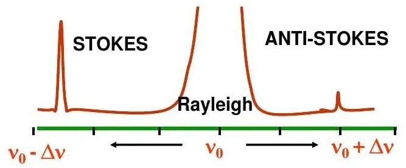
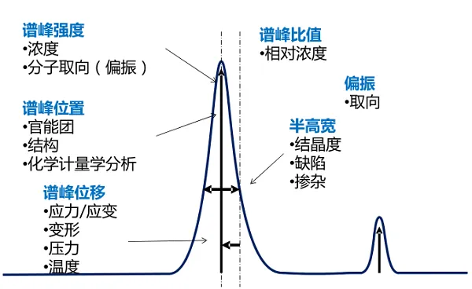
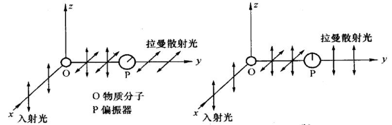
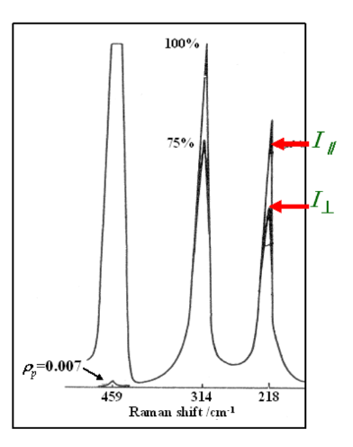

###  拉曼光谱
* ***拉曼光谱概述***

  + 拉曼(Raman)光谱与红外光谱(IR)均属分子振动光谱，二者都是研究分子振动能级的跃迁。**二者得到的信息相互补充**，是有机官能团鉴定及物质微观结构研究的两种常用方法。

  + 但就原理而论，**红外光谱与拉曼光谱有很大区别**。前者是吸收光谱，后者为散射光谱。一束光通过样品时，可能发生透射(吸收)、反射，也可能发生散射，其中有一种散射为拉曼散射，它与样品分子的振动能级相关，反映了分子的微观结构。

  + 由于光谱产生的原理不同，故**拉曼光谱在分析方法和适用范围等方面与红外光谱相比，有其独到之处**。

* ***拉曼光谱的基础原理？***

  + **一种无损的分析技术**拉曼光谱是一种无损的分析技术，它是基于光和材料内化学键的相互作用而产生的，可以提供样品化学结构、相和形态、结晶度以及分子相互作用的详细信息。

  + **光子与分子产生相互作用**当光线照射到分子并且和分子中的电子云及分子键结产生相互作用，就会发生拉曼效应。对于自发拉曼效应，光子将分子从基态激发到一个虚能量状态。当激发态的分子放出一个光子后并返回到一个不同于基态的旋转或振动状态。在基态与新状态间的能量差会使得释放光子的频率与激发光线的波长不同。

    - 光散射是自然界常见的现象。当一束光照射介质时，除被吸收之外，大部分是被反射或透过，另一部分光被介质向四面八方散射，在散射光中，大部分是**瑞利散射**，小部分是**拉曼散射**。
    
    - **瑞利散射**：弹性碰撞；无能量交换，仅改变方向；频率不发生改变的辐射散射($v=v_0$)；强度与$\lambda_0$的四次方成反比

    - **拉曼散射**：非弹性碰撞；方向改变且有能量交换；频率发生改变的辐射散射($v=v_0±\Delta v$)

  + 拉曼散射是一种非弹性散射，通常用来做激发的激光范围为可见光、近红外光或者在近紫外光范围附近。激光与系统声子做相互作用，导致最后光子能量增加或减少，而这些能量的变化可得知声子模式。这和红外光吸收光谱的原理基本相似，但二者所得到的数据结果是互补的。
    - 拉曼散射是由于能量透过光子和分子之间的相互作用而传递，就是一个非弹性散射的例子。

  + 如果最终振动状态的分子比初始状态时能量高，即**分子从基态跃迁到激发态**，所激发出来的光子频率则较低，以确保系统的总能量守恒。这个频率的改变被命名为**Stokes shift**。如果最终振动状态的分子比初始状态时能量低，即**分子从激发态跃迁到基态**，所激发出来的光子频率则较高，这一个频率的改变被命名为**Anti-Stokes shift**。

  + **光的波动性原因，拉曼光谱的产生源于分子振动过程中诱导偶极矩的变化**：分子在光电场E中，产生诱导偶极矩即感应偶极矩$\rho$，$$\rho=\alpha E$$，其中$\alpha$为极化率，在分子振动过程中，若其诱导偶极矩发生变化，则分子会与入射光子进行能量交换，产生拉曼光谱。
    - 极化率$\alpha$：衡量分子在电场作用下发生极化的难易程度;
    - 分子中两原子距离最大时，$\alpha$也最大；
    - **光谱选律**：只有引起极化率变化的分子振动才产生拉曼散射；
    - 拉曼散射强度与极化率成正比关系；
    - 分子极化即分子由于受到外界电场的影响导致的正负电荷中心的距离变大的现象；

* ***拉曼光谱图怎么去看？*** 
  + 拉曼光谱图以散射强度为纵坐标，拉曼位移为横坐标，瑞利线位置为零点。一副完整的拉曼光谱包括瑞利线，斯托克斯线，反斯托克斯线。
        

拉曼散射光谱图

      - 瑞利线强度最大，$\Delta v=0$;
      
      - 斯托克斯线和反斯托克斯线对应，完全对称的分布在瑞利线两侧；

      - 反斯托克斯线比斯托克斯线弱得多，一般记录得烂漫光谱只取斯托克斯线，且略去负号。

    + **拉曼位移**：散射光频率与激发光频率之差：$\Delta=|v_0 - v_s|$，**拉曼位移是拉曼光谱法进行结构与定性分析的依据**
        - 表征分子振-转能级的特征物理量；
        - 对不同物质：$\Delta v$不同；
        - 对同一物质：$\Delta v$与入射光频率无关；

    + **谱峰分析**：
        - **谱峰强度** 反映了物质浓度，分子取向（偏振）；**谱峰位置** 反映了官能团，化学结构，还可以进行化学计量学分析；**谱峰位移** 反映了物质的应力/应变，变形，压力，温度；**谱峰比值** 反映了物质的相对浓度；**偏振** 反映分子取向；**谱峰的半高宽** 反映物质的结晶度，缺陷，掺杂。
                

拉曼光谱图谱峰分析

        
        + **退偏度(depolarization ratio)**： 分子通常有特定的空间取向，因此对某一分子而言，入射光为偏振光引起的拉曼散射光也是偏振光，但其偏振方向不一定一致。而对于一个多分子体系，各个分子的空间取向不同且呈无规分布，因此即使入射的是平面偏振光，整体散射光却是非完全偏振的，这一现象称为**退偏**。
            
            - 在入射激光的垂直与平行方向放置偏振器，分别测得散射光强，退偏度为$$\rho_p = \frac{I_\bot}{I_\parallel}$$
                

拉曼光谱退偏度测量实验

            
            - $\rho_p$值越小，分子振动对称性越高。当$\rho_p$几乎趋近于0时，为**全对称分子振动（各向同性）**；当$\rho_p$介于0到$\frac{3}{4}$之间，为**非对称分子振动（各向异性）**。
            
            - 例：四氯化碳($\mathbf{CCl_4}$)的拉曼偏振光谱

              + $459 \ \mathbf{{cm}^{-1}}$所对应的振动，$\rho_p \sim 0$，各向同性。
              
              + $314$和$218 \ \mathbf{{cm}^{-1}}$所对应的振动，$\rho_p$较大，为各向异性。    
                

四氯化碳拉曼偏振光谱

* ***拉曼光谱图中高度和强度的区别？***

  + **拉曼光谱图中的谱峰的高度反映了拉曼散射的强度。**

* ***信噪比(Signal Noise Ratio SNR)计算的方法***

    + **用于计算信噪比的公式可能会对任何特定光谱数据集的表现灵敏度产生显著影响。**

    + **FSD方法(First Standard Deviation Method)，第一标准方差法，也称为平方根(SQRT)方法**：科学家将SNR定义为峰值信号减去背景信号的差值，再除以背景信号的差值。$$\frac{S}{N} = \frac{S_{397\mathbf{nm}}-S_{450\mathbf{nm}}}{\sqrt{S_{450\mathbf{nm}}}}$$峰值信号在水拉曼光谱图的拉曼位移$397\mathbf{nm}$处（其从$350\mathbf{nm}$处激发），在没有拉曼信号的区域$450\mathbf{nm}$处测量噪声。对于一个完美的光学系统，在$450\mathbf{nm}$处没有信号，因为那里没有拉曼发射，然而，所有的光电系统都有一定程度的杂散光和噪声，这将导致在$450\mathbf{nm}$处产生信号。上述公式假设噪声受到泊松统计量控制，因此，可以计算为在$450\mathbf{nm}$处的基线信号计数的平方根。
    
    + **均方根法(RMS Method)**：另一种常用的方法时用峰值信号与背景信号的差值除于背景信号噪声的均方根（RMS）值。公式如下所示：$$\frac{S}{N}=\frac{S_{397\mathbf{nm}}- S_{450\mathbf{nm}}}{N_{rms, \ background}}$$$$N_rms = \sqrt{\frac{\sum_i^n(S_i-\bar{S})^2}{n}}$$其中基于时间的背景信号被测量$n$次，$S$是整个动力学扫描的平均强度值。
