## 涉及专业名词及前置知识
* **服务质量管理**：QoS，服务质量。是网络满足业务质量要求的控制机制，它是一个端到端的过程，需要业务发起者到响应者之间所经历的网络各节点共同协作，以保证服务质量。

* **网络KPI**：网络关键性能指标，网络设备在运行的过程中会持续的产生大量的数据，例如告警,KPI,日志,MML等等。KPI是能够反映网络性能与设备运行状态的一类指标。对KPI进行检测，能够及时发现网络质量劣化风险。目前KPI异常检测指的是通过算法分析KPI的时间序列数据，判断其是否出现异常行为。

* **CDN**：Content Delivery Network，内容分发网络是建立并覆盖在承载网之上，由分布在不同区域的边缘节点服务器群组成的分布式网络。CDN应用广泛，支持多种行业、多种场景内容加速，例如：图片小文件、大文件下载、视音频点播、直播流媒体、全站加速、安全加速。CDN运营商通常会收集每个网站的各种KPI，如流量、延迟、命中率等，并对这些多变量KPI进行异常检测，以检测业务故障或降级。

* **概率混合模型**[[38]](#refer-anchor-38)：概率混合模型可以简单的理解为有多个（甚至是无数个）独立概率模型的凸组合(Convex Combination)，由于概率混合模型使用多个独立的概率分布，它可以描述一个复杂的数据分布，无论数据分布的结构如何复杂，总可以通过增加成分的方式来描述数据分布的局部特性，因此概率混合模型成为最有效的密度工具以及最常用的聚类工具之一。**概率混合模型的本质就是概率分布函数的卷积(convolution)。** 广义上的混合概率模型具有如下一般表达形式$$f(x)=\sum_{k=1}^K w_k f_k(x)$$, $f(\cdot)$表示一个具有$K$个独立成分的混合模型，其中$f_k(\cdot)$表示第k个成分，$w_k$则表示第k个成分的权重。下列是概率混合模型的分类和其最常见的一些模型，以及它们的一些应用。

	+ 有限概率混合模型：有限概率混合模型是较高层面的一个定义，它可以覆盖大多数最常用的混合模型，比如属于指数家族[[31]](#refer-anchor-31)(Exponential Family)的高斯（正态）混合模型[[32]](#refer-anchor-32)、多项式混合模型[[33]](#refer-anchor-33)、伽马混合模型[[34]](#refer-anchor-34)等，以及混合朴素贝叶斯模型[[35]](#refer-anchor-35)、混合马尔可夫模型[[36]](#refer-anchor-36)等

		- **高斯混合模型(GMM)**[[29]](#refer-anchor-29)：如果一个变量的取值是多个高斯分布联合产生的，如何进行参数估计呢？如果对于多个高斯分布联合产生的数据，使用单个高斯分布去拟合的化，可以想象拟合结果会很差。 GMM模型就是对由多个高斯分布线性拟合后产生的数据进行参数估计的模型。模型的概率密度函数为：$$f(x)=\sum_{i}^k \phi_{i}\frac{1}{\sqrt{2\pi}\sigma_i}e^{-\frac{(x-\mu)^2}{2\sigma_i^2}}$$我们可以通过EM算法[[37]](#refer-anchor-37)（期望最大化算法，Expectation-Maximization Algorithm）估计参数值$\phi_i,  \  \mu_i,  \ \sigma_i,\ i\in[1,\ k] $

			+ **GMM聚类**：可以依据观察值来自的具体高斯分布将其进行聚类，其实就是对于每个观察值求解$P(T=i|x), \ i\in[1, \ k]$.求解方式如下：$${\begin{aligned} P(T=i|x)&=\frac{P(T=i)P(x|T=i)}{P(x)} \\&= \frac{\phi_i \mathcal{N}(x|\mu_i, \ \sigma_i^2) \Delta{x}}{f(x)\Delta{x}} \\&=  \frac{\phi_i \mathcal{N}(x|\mu_i, \ \sigma_i^2)}{\sum_j^k\phi_j\mathcal{N}(x|\mu_j, \ \sigma_j^2)} \end{aligned}}$$ 

		- **概率主成分分析(PPCA)**[[30]](#refer-anchor-30) ：被认为是一种有约束的高斯混合模型(GMMs)，在建模数据量较小的高维数据时，其密度估计的灵活性优于全协方差矩阵的GMMs。

			+ 假设由一个由N个数据点组成的数据集$\mathbf X = \mathbf x_{n}$，其中每个数据点均为$D$维，$\mathbf x_n \in \mathbb R^{D}$。目标是使用较低维度$K \in D$，在隐变量$\mathbf z_n \in \mathbb R^K$下表示每个$\mathbf x_n$。主轴集合$\mathbf W$将隐变量与该数据相关联。

			+ 具体来说，我们假定每个隐变量为正态分布，$$\mathbf z_n \sim N(0, \mathbf I).$$通过投影，生成相应的数据点，$$\mathbf x_n | \mathbf z_n \sim N(\mathbf W \mathbf z_n, \sigma^2 \mathbf I), $$其中，矩阵$\mathbf W \in \mathbb R^{D \times K}$称为主轴。在概率PCA概括了经典PCA。对隐变量进行边缘化处理后，每个数据点的分布为$$\mathbf x_n \sim N(0, \mathbf {W} \mathbf {W^{\mathbf T}} + \sigma^2 \mathbf I).$$当噪声的协方差变得无穷小$(\sigma^2 \rightarrow 0)$时，经典PCA就是概率PCA的特例。

	+ 非参数概率混合模型：有限概率混合模型的一个局限性就是在进行模型估计之前需要人工指定成分个数$K$，但是，在某些应用中，我们甚至连$K$的大致取值范围都无法给定。这时，我们就希望有一种概率混合模型具有不确定的成分个数并可以根据需要动态增加，甚至可以趋向于无穷大——这就是非参数（Nonparametric）混合模型。非参数表示模型无法参数化
	
	+ Yan等[[26]](#refer-anchor-26) 提出了一种新的概率诊断框架，用于对新数据类别进行有效检测出。模式识别采用高斯混合模型(GMM)，其训练过程从传统的无监督学习改进为新型半监督学习。该方法客服了传统诊断方法的局限性，即从训练中将新类型的错误故障分类到现有类别中。

	+ Honda等[[27]](#refer-anchor-27)讨论了Local PCA与线性模糊聚类之间的关系，作者提出了一种新的聚类技术，即一种新的线性模糊聚类算法，可以灵活地捕捉局部线性结构。作者建议将概率PCA混合模型应用于线性聚类。

	+ Chen等[[28]](#refer-anchor-28)提出了一种带有高斯混合模型的张量递归神经网络(GmTRNN)来描述高分辨率距离像(HRRP)中距离单元之间的复杂时间依赖性。作者使用高斯混合模型对HRRP样本的序列特征进行聚类，已发现各种潜在的变化，并将他们分割成若干个簇，然后对每个簇使用TRNN。作者解决了RNN虽然能够有效地建模HRRP样本中的时间相关性，但它在不同的时间步长中共享参数，RNN中的共享参数可能不适合精确建模HRRP序列数据。

* **变分自编码器**[[1]](#refer-anchor-1)： (Variation Auto-Encoders, VAE)是一种基于变分贝叶斯推断的生成式网络，它通过潜在随机变量（Latent Random Variables）来实现样本的生成，从而有更好的鲁棒性。

	+ 传统的**自编码器模型**是一种人工神经网络，用于学习未标记数据的有效编码（无监督学习）[[2]](#refer-anchor-2)。其两个主要应用是降维和信息检索[[3]](#refer-anchor-3)。其主要由两部分构成：编码器(encoder)和解码器（decoder）。
		
		- 如下图所示	

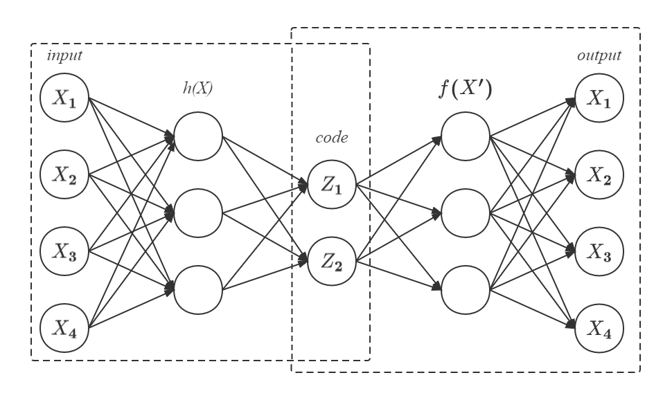

传统的自编码模型

		
		-  解码消息的空间$\mathcal{X}$；编码信息的空间$\mathcal{Z}$。其中$\mathcal{X}$和$\mathcal{Z}$是欧几里得空间。其中$\mathcal{X} = \mathbb{R}^m, \mathcal{Z} =  \mathbb{R}^n$，其中$m, n$表示维数。

		- 两个参数化的函数：编码器(encoder)：$E_\phi:\mathcal{X}_\theta\rightarrow\mathcal{Z}$，参数为$\phi$；解码器(decoder)：$D_\theta:\mathcal{Z}\rightarrow\mathcal{X^{\prime}}$，参数为$\theta$；

		- ${\forall}x\in\mathcal{X}$写作$z=E_\phi(x)$，其中$z$称为潜在变量(the latent variable)。对于${\forall}z\in\mathcal{Z}$写作$x^{\prime}=D_\theta(z)$，一般称之为消息(message)

		- 通常，编码器和解码器都被定义为多层感知器[[4]](#refer-anchor-4)(Multilayer Perceptrons)。例如，一层MLP编码器$E_\phi$是$$E_\phi = \sigma(\mathcal{W}x+b)$$，其中$\sigma$是激活函数，$\mathcal{W}$是一个称为"权重(weight)"的矩阵，并且b是一个称为"偏差(bias)"的向量。

	+ 自动编码器的训练[[3]](#refer-anchor-3)。通过一个task去衡量模型的质量。设参考概率分布$\mu_{ref}$，对于$\forall{x}\in\mathcal{X}, x\sim\mu_{ref}$，因此可以把损失函数(loss function)定义为$${\displaystyle L(\theta ,\phi ) :=\mathbb{\mathbb {E} } _{x\sim\mu_{ref}}[d(x,D_{\theta}(E_{\phi}(X)))]}$$，对于给定任务的最佳自动编码器${\displaystyle (\mu _{ref},d)}$，其最优参数通过下式求解，$${\displaystyle \arg \min _{\theta ,\phi }L(\theta ,\phi )}$$

		- 对于最优自动编码器的搜索可以通过任何数学优化技术来完成，但是通常通过**梯度下降**。在大多数情况下参考概率分布为，$${\displaystyle \mu _{ref}={\frac {1}{N}}\sum _{i=1}^{N}\delta _{x_{i}}}$$

		- 质量函数是L2损失[[7]](#refer-anchor-7)：${\displaystyle d(x,x')=\|x-x^{\prime}\|_{2}^{2}}$。故寻找最优自编码器的问题是**最小二乘优化**[[5]](#refer-anchor-5) [[6]](#refer-anchor-6)：$${\displaystyle \min _{\theta ,\phi }L(\theta ,\phi ),{\text{where }}L(\theta ,\phi)={\frac {1}{N}}\sum _{i=1}^{N}\|x_{i}-D_{\theta }(E_{\phi }(x_{i}))\|_{2}^{2}}$$

	+ 变分自编码器构造依据的原理[[1]](#refer-anchor-1)，具体结构如下
		- 如下图所示，与自动编码器由编码器与解码器两部分构成相似，VAE利用两个神经网络建立两个概率密度分布模型：一个用于原始输入数据的变分推断，生成隐变量的变分概率分布，称为**推断网络**；另一个根据生成的隐变量变分概率分布，还原生成原始数据的近似概率分布，称为**生成网络**。
		
		- 

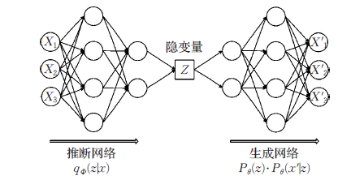

变分自编码器结构

		
		- 假设原始数据集为$$X = \{{x^{(i)}}\}_{i=1}^N$$
		
		- 每个数据样本$x_i$都是随机产生的相互独立、连续或离散的分布变量，生成的数据集合为$$\widetilde{X} = \{{\widetilde{x}^{(i)}}\}_{i=1}^N$$
	
		- 并且假设该过程产生隐变量$Z$，即$Z$是决定$X$属性的神秘原因(特征)。其中可观测变量$X$是一个高维空间的随机向量，不可观测变量$Z$是一个相对低维空间的随机向量，那样本生成的过程分为两步：1）从先验分布$p_{\theta^{*}}(z)$中随机采样生成$z^{(i)}$；2）从条件概率分布$p_{\theta^{*}}(x|z)$中采样生成$x^{(i)}$。但是这个过程在我们看来是隐藏的；真正的参数$\theta^{*}$以及潜在变量$z^{(i)}$的值对于我们来说是未知的。但作者并未对$p_\theta(z)$进行建模，而是使用$q_{\phi}(z|x)$。该生成模型可以分成两个过程：

			+ 

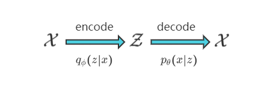

VAE简化模型

		
			+ （1）隐变量$Z$后验分布的近似推断过程：$$q_{\phi}(z|x)$$，即推断网络。

			+ （2）生成变量$X^{\prime}$的条件分布生成过程：$$P_{\phi}(z)P_{\theta}(x^{\prime}|z)$$，即生成网络。
			
		- 变分自动编码器
			
			+ 变分自动编码器的推断网络输出的推断网络输出的应该是$Z$后验分布$p(z|x)$。但是这个$p(z|x)$后验分布本身是不好求的。因此Kingma等[[1]](#refer-anchor-1)提出了一种方法，利用另一个可伸缩的分布$q_{\phi}(z|x)$来近似$p(z|x)$。通过深度学习网络来学习$q_{\phi}(z|x)$中的参数$\phi$，一步步优化使其与$p(z|x)$十分相似，就可以用它来对复杂的分布进行近似的推理。

			+ 为了使得两个分布尽可能的相似，我们可以最小化两个分布之间的KL散度[[13]](#refer-anchor-13)(主要用于衡量两个分布之间的差距)，KL散度的定义[[14]](#refer-anchor-14)如下，$$\mathrm{KL}(p(x)||q(x)) = \sum_{x\in X}[p(x)\ln \frac{p(x)}{q(x)}] = \mathbb{E} _{x\sim p(x)}[\ln \frac{p(x)}{q(x)}]$$因此衡量目标为$$\min \mathrm {KL}(q_\phi(z|x)||p_\theta(z|x))$$，KL散度为$${\displaystyle {\begin{aligned} \mathrm {KL}(q_{\phi }({z|x})\parallel p_{\theta }({z|x}))&=\mathbb {E} _{z\sim q_{\phi }(\cdot |x)}\left[\ln {\frac {q_{\phi }(z|x)}{p_{\theta }(z|x)}}\right]\\&=\mathbb {E} _{z\sim q_{\phi }(\cdot |x)}\left[\ln {\frac {q_{\phi }({z|x})p_{\theta }(x)}{p_{\theta }(x,z)}}\right]\\&=\ln p_{\theta }(x)+\mathbb {E} _{z\sim q_{\phi }(\cdot |x)}\left[\ln {\frac {q_{\phi }({z|x})}{p_{\theta }(x,z)}}\right]\end{aligned}}}$$
		
			+ 从上式可知，要最小化KL散度，因为$p_\phi(x)$是定值，即$\ln p_\phi(x)$亦是一个定值，所以要使得$$\mathbb {E} _{z\sim q_{\phi }(\cdot |x)}\left[\ln {\frac {q_{\phi }({z|x})}{p_{\theta }(x,z)}}\right]$$最小，即使得$$\mathbb {E} _{z\sim q_{\phi }(\cdot |x)}\left[\ln {\frac {p_\theta(x, z)}{q_\phi(z|x)}}\right]$$最大

			+ 现定义证据下限(ELBO)：$${\displaystyle L_{\theta ,\phi }(x):=\mathbb {E} _{z\sim q_{\phi }(\cdot |x)}\left[\ln {\frac {p_{\theta }(x,z)}{q_{\phi }({z|x})}}\right]=\ln p_{\theta }(x)-\mathrm{KL}(q_{\phi }({\cdot |x})\parallel p_{\theta }({\cdot |x}))}$$

			+ 最大化ELBO$${\displaystyle \theta ^{*},\phi ^{*}={\underset {\theta ,\phi }{\operatorname {argmax} }}\,L_{\theta ,\phi }(x)}$$

			+ 相当于同时最大化$\ln p_\theta(x)$并最小化${\displaystyle \mathrm{KL}(q_{\phi }({z|x})\parallel p_{\theta }({z|x}))}$. 即最大化观测数据的对数似然，最小化近似后验$q_\phi(\cdot|x)$到明确后验$p_\theta(\cdot|x)$的散度。$${\displaystyle {\begin{aligned} \mathrm {KL}(q_{\phi }({\cdot|x})\parallel p_{\theta }({\cdot|x}))&=\sum_z {q_\phi(z|x) \ln \frac {q_\phi(z|x)}{p_\theta(z|x)}}\\&=\int q_\phi(z|x) \ln{\frac{q_\phi(z|x)}{p_\theta(z|x)}}\,dz \\&=\int q_\phi(z|x) \ln{q_\phi(z|x)}\,dz-\int p_\theta(z|x) \ln{p_\theta(z|x)}\,dz  \\&=\int \mathcal{N}(z;\mu, \sigma^2)\ln\mathcal{N}(z;\mu,\sigma^2)\,dz + \int \mathcal{N}(z;\mu, \sigma^2)\ln\mathcal{N}(z;0,1)\,dz  \\&=\mathbb{E}_{z \sim \mathcal{N}(\mu,\sigma^2)}\left[\ln \mathcal{N}(z;\mu,\sigma^2)\right]-\mathbb{E}_{z \sim \mathcal{N}(\mu,\sigma^2)}\left[\ln \mathcal{N}(z;0,1)\right]\\&=\mathbb{E}_{z \sim \mathcal{N}(\mu,\sigma^2)}\left[\ln (\frac{1}{\sqrt{2\pi}\sigma}e^{-\frac{(z-\mu)^2}{2\sigma^2}})\right]-\mathbb{E}_{z \sim \mathcal{N}(\mu,\sigma^2)}\left[\ln(\frac{1}{\sqrt{2\pi}}e^{-\frac{z^2}{2}})\right]\\&=\frac{1}{2}(\sigma+\mu^2-\ln\sigma^2-1) \end{aligned}}}$$

		- 重新参数化(Reparameterization)

			+ 利用梯度下降方法，高效率搜索$${\displaystyle \theta ^{*},\phi ^{*}={\underset {\theta ,\phi }{\operatorname {argmax} }}\,L_{\theta ,\phi }(x)}$$，对于$${\displaystyle \nabla _{\theta }\mathbb {E} _{z\sim q_{\phi }(\cdot |x)}\left[\ln {\frac {p_{\theta }(x,z )}{q_{\phi }({z|x})}}\right]=\mathbb {E} _{z\sim q_{\phi }(\cdot |x)}\left[\nabla _{ \theta }\ln {\frac {p_{\theta }(x,z)}{q_{\phi }({z|x})}}\right]}$$，其结果很容易求解。

			+ 然而，对于$${\displaystyle \nabla _{\phi }\mathbb {E} _{z\sim q_{\phi }(\cdot |x)}\left[\ln {\frac {p_{\theta }(x,z )}{q_{\phi }({z|x})}}\right]}$$不能把${\displaystyle \nabla _{\phi }}$放到期望中，因为$\phi$出现在概率分布本身中，故其不可导，因此无法返回梯度信息。重新参数化技巧，亦称随机反向传播[[15]](#refer-anchor-15)解决了这个问题[[1]](#refer-anchor-1)[[16]](#refer-anchor-16)[[17]](#refer-anchor-17)。重参数化技巧可以求导的本质在于解耦了网络计算和采样操作，其方法主要包含两类：
				- 连续分布采样：Durk P. Kingma等[[21]](#refer-anchor-21)使用高斯分布采样经过仿射变换的重参数化方法；
				- 离散分布采样：Eric Jang等[[20]](#refer-anchor-20)提出Gumbel-Softmax估计器，其在结构化输出预测和具有分类潜在变量的无监督生成建模任务上优于最先进的梯度估计器。
				
				如下图所示，这里是$z \sim q_{\phi}(z|x) \sim \mathcal{N} (\mu_{\phi}(x), \sigma_{\phi}^2(x))$连续分布采样，我们可以从单位高斯采样$\varepsilon \sim \mathcal N(0, I)$，然后通过潜在分布的均值$\mu$改变随机采样的$\varepsilon$，最后通过潜在分布的方差$\sigma$对其进行缩放。因此构造$z=\mu_\phi(x)+\sigma_\phi(x)\varepsilon$

				+ 

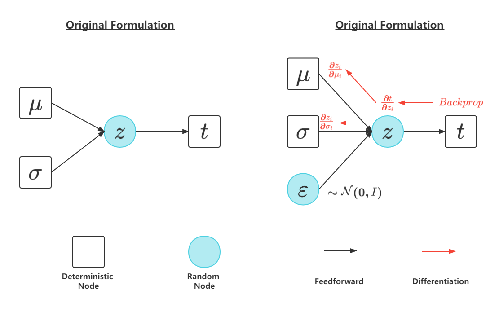

重参数化技巧

			+ 此时编码器可以从$\varepsilon \sim \mathcal{N}(0,I)$中进行采样，并且不受参数$\phi$的影响，因此可以将下式作为目标函数$${\displaystyle \nabla _{\phi }\mathbb {E} _{z\sim q_{\phi }(\cdot |x)}\left[\ln {\frac {p_{\theta }(x,z)}{q_{\phi }({z|x})}}\right]=\mathbb {E} _{\epsilon \sim \mathcal {N}(0, I) }\left[\nabla _{\phi }\ln {\frac {p_{\theta }(x,\mu _{\phi }(x)+\sigma_{\phi }(x)\epsilon )}{q_{\phi }(\mu _{\phi }(x)+\sigma_{\phi }(x)\epsilon |x)}}\right]}$$上式是可微的，并且能对参数$\phi$和$\theta$进行随机梯度下降.

			+ 由于我们重新参数化$z$，我们需要找到$q_\phi(z|x)$. $${\begin{aligned} \ln{q_\phi(z|x)} &= \ln{\mathcal{N}(\mu_\phi(x),\sigma_{\phi}^2}(x)) \\&= \ln \frac{1}{\sqrt{2\pi} \ \sigma_\phi(x)} \ \exp{- \frac{(z-\mu_\phi(x))^2}{2\sigma_\phi^2(x)}} \\&=  - \frac{(z-\mu_\phi(x))^2}{2\sigma_\phi^2(x)} - \frac{1}{2}  \ln 2\pi - \ln \sigma_\phi(x) \\&= - \frac{1}{2}\varepsilon^2- \frac{1}{2}\ln 2 \pi- \ln \sigma_\phi(x)        \end{aligned}}$$

		+ 综上所述VAE的流程可简化为下图

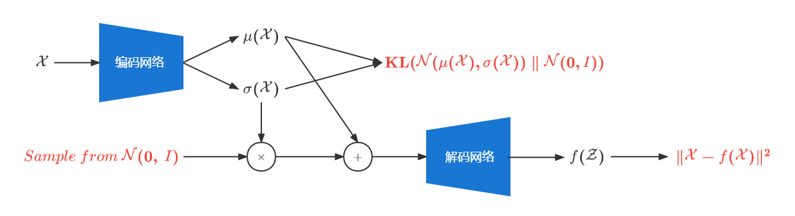

VAE单次整个流程

	+ VAE和AE的差距[[8]](#refer-anchor-8)在于
		- AE的特点是数据相关的(data-specific)，这意味者自动编码器只能压缩那些与训练数据类似的数据，其是一类数据对应一种编码器，无法拓展一种编码器去应用于另一类数据。

		- 自动编码器是有损的，即解压缩的输出于原来的输入相比是退化的，MP3，JPEG等压缩算法也是如此。

		- VAE倾向于数据生成(data-generation)。只要训练好了decoder，我们就可以从某一个标准正态分布（一个区间）生成数据作为解码器decoder的输入，来生成类似的、但不完全相同于训练数据的新数据，也许是我们从类见过的新数据，作用类似于GAN。

		- VAE的“编码器”和“解码器”的输出都是受参数约束变量的概率密度分布，而不是某种特定的编码。

		- 二者虽然都是$\mathcal{X}\rightarrow\mathcal{Z}\rightarrow\mathcal{X^{\prime}}$，但是AE寻找的是单值映射关系，即$z=f(x)$，而VAE寻找的是分布的映射关系，即$\mathcal{X}\rightarrow\mathcal{Z}$.
			
			+ 为什么会有这区别呢？[[9]](#refer-anchor-9)AE的decoder做的是$\mathcal{Z}\rightarrow\mathcal{X^{\prime}}$变换，那么理论上它可以作为生成器使用。但这里有个问题，显然不是所有的$\mathbb{R}^{n}$都是有效的$\mathcal{Z}$。$\mathcal{Z}$的边界在哪里？如何得到有效的$\mathcal{Z}$，从而生成$\mathcal{x}$？这些都不是AE可以解决的，为了解决这个局限性，VAE映射的是分布，而分布可以通过采样得到有效的得到$\mathcal{z}$，从而生成相应的$\mathcal{x^{\prime}}$。

		- VAE模型可能存在过度正则化的潜在空间，即后验坍塌(posterior collapse)，可能是由于在潜在空间上假设了过度简化的先验（各向同向高斯）。Yuri Burda等[[18]](#refer-anchor-18)提出了一种重要性加权自动编码器（IWAE），并证明了IWAE比VAE学习更丰富的潜在空间表示，从而改善了密度估计基准测试对数似然。QT Truong等[[19]](#refer-anchor-19)提出了通过引入约束自适应先验(CAP)来学习依赖于用户和项目的先验分布来缓解这个问题。

		- 变分自编码器通常与自编码器模型相关联，因为它具有架构亲和力，但是在目标和数学公式方面存在显著差异。变分自动编码器允许将统计推断问题（例如从另一个随机变量推断一个随机变量的值）重写为统计优化问题（即找到某些目标函数最小化的参数值）[[10]](#refer-anchor-10)[[11]](#refer-anchor-11)[[12]](#refer-anchor-12)。

* 变分递归神经网络(Variational RNN)：将原始的VAE拓展到了时间序列上，实现了对于时间序列的表征与生成。在传统的RNN建模当中，**对于序列不确定性的建模是通过最后的输出函数$\mathcal{g}_{\tau}(\cdot)$实现的**，这样简单的方式对于波动大、变动多的序列数据来说是不够的，可能无法很好地分辨信号与噪声。因此Chung等[[39]](#refer-anchor-39)将VAE方法拓展到了RNN当中，通过潜在随机变量包含在RNN的隐藏状态，来实现对多为时间序列的表征。
	+ 递归神经网络(RNN)[[40]](#refer-anchor-40)：假设我们有一个长度为$T$的时间序列$\mathbf {x = (x_1, x_2,\ldots,x_T)}$，在时间步长为$t$，RNN读取输入$\mathbf{x}_t$，然后更新隐层状态$\mathbf{h}_t = f_\phi(\mathbf{x}_t, \mathbf{h}_{t-1})$，其中$f_\theta(\cdot)$是以$\theta$为参数的神经网络（例如LSTM、GRU等）；

		+ 由于RNN是按照从前往后的顺序依次计算的，那么序列$\mathbf{x}$的联合概率分布可以写为：$$\mathbf{p(x_1, x_2,\ldots,x_T)} = \prod_{t=1}^Tp(\mathbf{x_t|x_{<t}})$$其中$ p(\mathbf{x_t}|\mathbf{x_{<T}}) = \mathcal{g}_{\tau}(\mathbf{h_{t-1}})$，即从历史隐层状态$\mathbf{h_{t-1}}$中得到$\mathbf{x_t}$的概率分布，$\mathcal{g}_\tau(\cdot)$是以$\tau$为参数的函数。为了描述概率分布，通常把$\mathcal{g}_\tau(\cdot)$分为两个过程，想通过一个神经网络$\varphi_{\tau}(\cdot)$得到一个参数集$\phi_t$，即$\phi_t=\varphi_\tau(\mathbf{h_{t-1}})$，然后得到一个用$\phi_t$描述的分布$p_{\phi_t}(\mathbf{x_t|x_{<t}})$，例如先利用神经网络得到高斯分布的均值$\mu$和标准差$\sigma$，然后得到用$\mu$和$\sigma$描述的高斯分布$\mathcal{N}(\mu, \sigma^2)$。
		
	+ **VRNN与RNN的区别**：		
		* 与RNN的区别：与标准RNN相比，VRNN隐藏状态$h_t$现在依赖于潜在变量$z_t$，其中$z_t$由条件VAE学习，该条件VAE以先前隐藏状态$h_{t-1}$为条件。

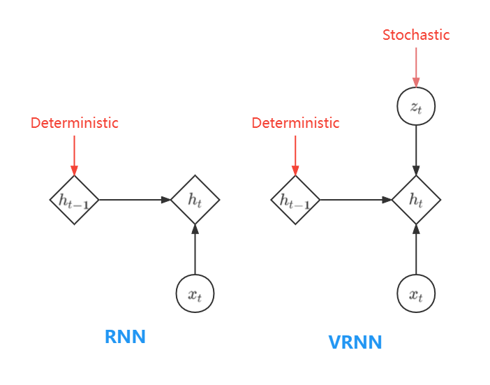

标准RNN和VRNN在计算隐藏状态的区别

如下图所示，在标准RNN中，$x_t$的生成仅依赖于$h_{t-1}$，而在VRNN中，还依赖于$z_t$。

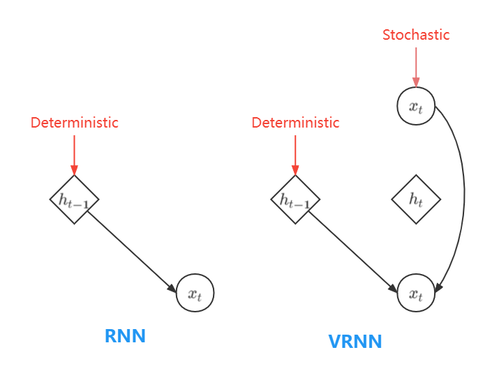

标准RNN和VRNN的比较

	+ **VRNN模型的各个流程**
		* 模型的各个流程可以总结为下图：

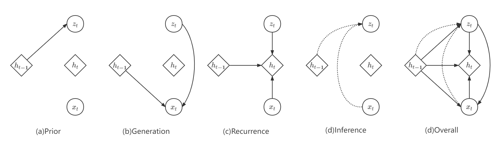

VRNN模型的各个流程

	+ **VRNN生成过程**：
		* VAE：从一个先验分布$p(z)$里面采样出一个潜变量$z$，然后通过条件生成网络$p_\phi(x|z)$得到重构样本的分布概率。

		* VRNN想要生成的是一个序列，那么应该在每一个时间步$t$中都有一个VAE，逐时间步地生成重构样本$x_t$；

			+ 考虑到时间序列的依赖性，则先验分布$p(z)$不应该是完全独立的，而是应该依赖于历史信息，这里把$\mathbf{h_{t-1}}$当作历史信息（看做是对历史序列$\mathbf{x_{\leq{t-1}}}$的编码），因此先验分布形式为：$$\mathbf{z_t} \sim \mathcal{N}(\mu_{0,t}, \mathbf {diag}(\sigma_{0,t}^2)), \mathbf{where} \ \ [\mu_{0,t},\sigma_{0,t}] = \varphi_{\tau}^{\mathbf{prior}}\mathbf{(h_{t-1}})$$其中$\mu_{0,t}, \sigma_{0,t}$是先验分布的均值和方差，它们依赖于前一时间步的隐层状态$\mathbf{h_{t-1}}$

			+ 类似地，条件概率分布$p_\phi(x|z)$同样也要依赖于$\mathbf{h_{t-1}}$，其形式为：$${x_t|z_t} \sim \mathcal{N}(\mu_{x,t}, \mathbf{diag}(\sigma_{x,t}^2)), \ \ \mathbf{where} [\mu_{x,t},\sigma_{x,t}] = \varphi^{\mathbf{dec}}_{\tau}(\varphi_{\tau}^{\mathbf{z}}, \mathbf{h_{t-1}})$$

			+ 隐藏层状态的更新公式为：$$\mathbf{h_t}=f_\theta((\varphi_\tau^{\mathbf{x}}), \varphi_\tau^{\mathbf{z}}(\mathbf {z_t}), \mathbf{h_{t-1}})$$，其中$\mu_{x,t}, \sigma_{x,t}$是条件生成分布的均值和方差，$\varphi_{\tau}^{\mathbf{x}}, \varphi_{\tau}^{\mathbf{x}}$两个网络可以看做是$x,z$的特征提取器。

			+ 由于$\mathbf{h_{t-1}}$依赖于$\mathbf{x_{\le{t-1}}}$和$\mathbf{z_{\le{t-1}}}$，因此关于$\mathbf{x_t}$和$\mathbf{z_t}$的分布可以写作：$p(\mathbf{x_t | z_{\le t}, x_{<t}})$和$p(\mathbf{z_t | x_{< t}, z_{<t}})$，整个序列的联合概率分布可以写为：$$p(\mathbf{x_{\le T},z_{\le T}}) = \prod_{t=1}^Tp(\mathbf{x_t | z_{\le t}, x_{<t}})p(\mathbf{z_t | x_{< t}, z_{<t}})$$

	+ **推断过程**：加入历史依赖后，后验分布的的形式变为$$\mathbf{z_t | x_t} \sim \mathcal{N}(\mu_{z,t},\mathbf{diag}(\sigma_{z,t}^2)), \ \mathbf{where} \ [\mu_{z,t},\sigma_{z,t}] = \varphi_{\tau}^{enc}(\varphi_{\tau}^{\mathbf{x}}(\mathbf{x_t}), \mathbf{h_{t-1}})$$那么联合分布可以写为$$q(\mathbf{z_{\le T}}|\mathbf{x_{\le T}}) = \prod_{t=1}^Tq(\mathbf{z_t} | \mathbf{x_{\le t},z_{<t}})$$

		

## 前人工作成就总结

### 前人工作

一些无监督方法，利用循环神经网络RNN进行时间序列特征提取，用于多变量时间序列异常检测等等。

* **深度学习异常检测方法**在网络KPI异常检测中，考虑到异常或异常值的行为通常不同于正常数据。基于这一理念，人们提出了大量新颖的无监督方法，主要是利用循环神经网络(RNN)进行时间序列特征提取，用于多变量时间序列异常检测。**当前的深度异常检测模型无法有效处理问题一和问题二**
	+ Zhang等[[22]](#refer-anchor-22)提出了一种多尺度卷积循环编码-解码器(MSCRED)，用于在多元时间序列数据中执行异常检测和诊断。其模型主要从时序数据中提取特征矩阵，每一个特征矩阵的大小与时序数据的维度一致。所以对于维度较小的时序数据来说，可能会存在问题。模型中对特征值的选取很重要，因为输入噪声具有鲁棒性，特征值的选取决定了时间序列的不稳定性对结果的影响。该模型能够捕获每个时间序列中的时间依赖性，并且能够对不同时间序列对之间的相互关系进行编码。此外，模型对噪声具有鲁棒性，能够根据不同事件的严重程度为操作员提供不同级别的异常分数。
		+ MSCRED首先构建多尺度的Signature Matrices，用于描述不同时间步对应的=系统状态，然后，在给定的Signature Matrices上，利用卷积编码器去编码变量之间的相关特性，同时利用基于attention的卷积LSTM（ConvLSTM）去捕获时间依赖特性。最后利用解码器重构特征以及利用Residual Signature Matrices去检测和诊断异常。

	+ Su等[[23]](#refer-anchor-23)提出了一种用于多变量时间序列异常检测的随机循环神经网络(OmniAnomaly)。其核心思想是通过使用随机变量连接和平面归一化流等关键技术学习多元时间序列的稳健表示来捕获多元时间序列的正常模式，通过表示重建输入数据，并使用重建概率来确定异常。
		+ 相较于Zhang等提出的MSCRED，OmniAnomaly在考虑时间依赖性和随机性的同时，学习潜在表示，以捕获多元时间序列的正常模式。
		+ 在给定随机深度学习方法的情况下，Su等对如何对检测到的实体级异常提供解释。
		+ 提出了Peaks-Over-Threshold方法，用于自动异常阈值选择。

	+ Dai等[[24]](#refer-anchor-24)提出一种使用多变量KPI的鲁棒且抗噪声的异常检测机制。作者认为不同的KPI受到底层系统的某些时不变特征的约束，并且明确地建模这种不变性可能有助于抵抗数据中地噪声。所以，作者提出了一种新的异常检测方法（SDFVAE），它通过将潜在变量显式分解为动态和静态部分来学习 KPI 的表示。
		+ 对于表现出非加性高斯噪声的KPI数据，深度学习模型难以学习它的正常模式，这样使得异常检测性能下降，SDFVAE提高了模型在表现出非加性高斯噪声的KPI数据上的学习能力，由于其他深度学习方法。

	+ Zong等[[25]](#refer-anchor-25)提出了一种无监督异常检测的深度自动编码高斯混合模型(DAGMM)。对于时间序列数据中异常位置的检测，作者首先对多维数据进行降维，然后采用混合高斯模型对降维后的数据进行密度估计，最后根据密度估计结果检测异常数据。
		+ 传统模型对降维后的数据进行密度估计。低维的数据会损失信息量，直接使用低维数据进行密度估计的模型容量低、效果差；因此作者对降维后的数据进行重建，结合低维数据和重建误差进行密度估计，增大了模型的容量。
		+ 传统方法是先训练降维模型，再训练密度估计模型，未能融合二者。因此作者引入正则项，联合降维模型和密度估计模型进行训练。

### 存在的问题
* **问题一**：单个网站在不同时间段的非平稳依赖（The Non-stationary Dependencies）会降低深度异常检测模型的性能:：

	+ 由于用户的正常行为或CDN的调度等，相应的KPI通常表现出非平稳的时间特征，不应将其归类为服务失败或退化。但是，这些类型的预期模式很难被目前的方法捕获，这会使得目前的模型在CDN KPI异常检测方面的表现性能很差。
	
	+ 从Figure1(a)和Figure1(d)可以明显看出，工作日和周末的用户请求行为是不同的。前一个网站显示了在周末相对于工作日的用户请求激增，而后一个数据显示了相反的情况。

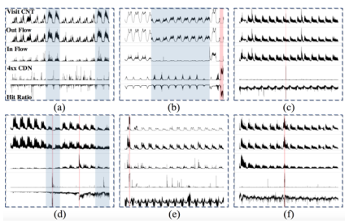

Figure1

* **问题二**：不同的网站在CDN KPI中表现出不同的特征，但其中又有一些相似特征。这使得现有的**单个深度异常检测模型无法良好的捕捉这种动态复杂性**。
	+ Figure1(b)是另一种典型情况，即部分用户被CDN的调度中心调度到另一组边缘节点上；所以，KPI的变化时刻，发生在这段时间内。

	+ Figure1(a)中的视频点播网站的KPI通常与Figure1(e)中的直播网站有很大的不同。
	 	
		- 因为一般商业CDN会为数百甚至数千个网站提供服务，这些网站会因为服务类型和用户的请求行为的不同而表现出不同的特征，因此可以观察到不同网站的KPI在空间和时间特征上的变化。

* **问题三**：资源浪费
	+ 为了对多个网站进行有效的异常检测，现有的深度异常检测方法通常为每个网站训练一个单独的模型，从而存在为每个网站训练和维护大量的单独模型的问题，不仅消耗巨大的计算和存储资源，但也增加了模型维护的成本。
		- 例如，Figure1(c)和Figure1(f)显示出相似的特征，但它们属于不同网站的KPI。在这种情况下，为每个网站训练一个单独的模型完全是浪费。

## 难点与挑战

* Challenges:  In the scenario of Content Delivery Networks (CDN), KPIs that belong to diverse websites usually exhibit various structures at different timesteps and show the non-stationary sequential relationship between them, which is extremely difficult for the existing deep learning approaches to characterize and identify anomalies.

### 挑战

* 现有的许多深度学习方法（这里要细化） ，模型学习正常情况下的网络KPI，以构建并训练模型，从而应用于无监督的网络KPI异常检测，即深度异常检测。

* **CDN KPI数据存在的问题**：
	+ CDN下具有多个节点，每个节点网络KPI曲线的多样性，即KPI曲线表现为周期型的，有稳定型的，也有不稳定型的。
	+ CDN下往往具备大量的节点网络，这些网络的异常种类多，核心网网元数据多，故障发生的类型也多种多样，导致了异常种类也多种多样，即KPI之间呈现出非平稳的顺序关系。

## 文章详细综述

### 作者的工作
* 表征不同的复杂KPI时间序列结构和动态特征；

* 基于以上问题，现有的深度学习方法非常难以表示和识别CDN网下节点网络的异常，因此作者提出了一种方法，一种适用于多变量CDN KPI的切换高斯混合变分循环神经网络(SGmVRN)。
	+ SGmVRNN引入变分循环结构，并将其潜在变量分配到混合高斯分布中，以对复杂的KPI时间序列进行建模并捕捉其中的不同结构和动态特征，而在下一步中，它结合了一种切换机制来表征这些多样性，从而学习更丰富的KPI表示。
	+ 为了有效的推理，我们开发了一种向上向下的自动编码推理方法，它结合了参数的自下而上的似然性和自下而上的先验信息，以实现准确的后验近似。

* **结果**：通过SGmVRNN方法构造出来的模型应用到不同网站的CDN KPI异常识别，SGmVRNN模型的平衡F分数明显高于目前最优秀的模型。

### 工作细节

#### 问题定义

第n个多元CDN KPI为$x_n={x_{1,n},x_{2,n},…,x_{T,n}}$,

* 其中$n=1,…,N$是KPI时间序列个数；
* T是$x_n$的持续时间；
* $x_{t,n}$是在时间T的观测值；
* $x_{t,n}∈\mathbb{R}^V$, $V$表示KPI的个数；
* $x_n∈\mathbb{R}^{T×V}$。

**多元CDN KPI的异常检测问题**被定义为确定某一网站在某一时间，$x_{t,n}$的观察结果是否异常的问题。

#### 模型阐述
 

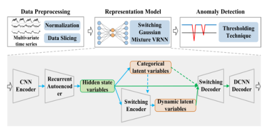

Figure2

* 主要包含三个关键模块：
	+ **数据预处理模块(Data Preprocessing)**：负责对原始多元CDN KPI数据进行预处理。采用归一化和滑动时间窗方法
	+ **表示模块(Representation Model)**：使用SGmVRNN来学习多元CDN KPI的复杂结构和动态特性。
	+ **异常检测模块(Anomaly Detection)**：根据表示模型推导的重构概率来检测异常。

#### Data Preprocessing

#### Representation Model

##### SGmVRNN介绍

* SGmVRNN：将概率混合和切换机制融合到VRNN中，它将**概率混合**和**切换机制**融合到VRNN中，从而有效地模拟单个网站的多元CDN KPI相邻时间步之间的非平稳时间依赖性，以及不同网站之间的动态特性。
	+ SGmVRNN特点：能够在不同的时间学习不同的结构特征，并捕捉它们之间的各种时间依赖性，以表征不同CDN网站的多元KPI中的复杂结构和动态特征。
	+ 切换机制：

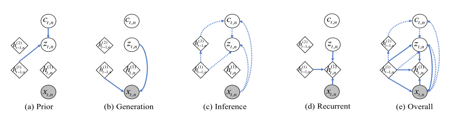

Figure3

* 如何解决主要挑战？
	+ 将切换机制与混合模型相结合，SGmVRNN可以利用切换机制对电流输入的刻画和多种时间变化的传输提供足够的表示能力，从而解决第一个问题。
	+ 利用混合高斯分布潜变量很好地处理多样化的网站，从而解决第二个问题。

##### VRNN(变分递归神经网络)

* 在每个时间步上都包含一个变分自编码器(VAE),假设每个时间步的潜随机变量来自高斯混合分布，其每个组件的参数由两个元素组成:
	+ 当前输入的特定先验
	+ 来自上一个时间步的潜在状态的切换。、

+ VRNN的潜随机变量先验，服从标准正态分布。
+ 引入一个离散指标变量c_(t,n)来指导当前时间步长的先验选择以及相邻时间步长之间信息的转换。

##### 模型参数学习

* 作者提出了一种自下而上自编码变分推理方法以获取SGmVRNN模型的参数，结合参数的自底向上似然和自底向上先验信息进行精确的后验逼近，从而得到SGmVRNN的丰富潜在表示。作者为了实现潜变量后验的精确逼近，我们提出了一种SGmVRNN的向上向下自编码变分推理方法。

## Reference

- [1] Kingma, Diederik P., and Max Welling. "Auto-encoding variational bayes." arXiv preprint arXiv:1312.6114 (2013).

- [2] Kramer M A. Nonlinear principal component analysis using autoassociative neural networks[J]. AIChE journal, 1991, 37(2): 233-243.

- [3] Goodfellow I, Bengio Y, Courville A. Deep learning[M]. MIT press, 2016.

- [4] Hastie, Trevor, et al. The elements of statistical learning: data mining, inference, and prediction. Vol. 2. New York: springer, 2009.

- [5] [Least squares optimization](https://people.duke.edu/~ccc14/sta-663-2018/notebooks/S09F_Least_Squares_Optimization.html#Least-squares-optimization)

- [6] Grisetti G, Guadagnino T, Aloise I, et al. Least squares optimization: From theory to practice[J]. Robotics, 2020, 9(3): 51.

- [7] Bühlmann, Peter, and Bin Yu. "Boosting with the L 2 loss: regression and classification." Journal of the American Statistical Association 98.462 (2003): 324-339.

- [8] An, Jinwon, and Sungzoon Cho. "Variational autoencoder based anomaly detection using reconstruction probability." Special Lecture on IE 2.1 (2015): 1-18.

- [9] [【深度学习】AE与VAE] (https://blog.csdn.net/sinat_36197913/article/details/93630246?spm=1001.2101.3001.6650.1&utm_medium=distribute.pc_relevant.none-task-blog-2%7Edefault%7ECTRLIST%7ERate-1-93630246-blog-110879937.pc_relevant_multi_platform_whitelistv3&depth_1-utm_source=distribute.pc_relevant.none-task-blog-2%7Edefault%7ECTRLIST%7ERate-1-93630246-blog-110879937.pc_relevant_multi_platform_whitelistv3&utm_relevant_index=2)

- [10] Kramer, Mark A. "Nonlinear principal component analysis using autoassociative neural networks." AIChE journal 37.2 (1991): 233-243.

- [11] Hinton, Geoffrey E., and Ruslan R. Salakhutdinov. "Reducing the dimensionality of data with neural networks." science 313.5786 (2006): 504-507.

- [12] Jang, E. "A beginner’s guide to variational methods: Mean-field approximation." (2016).

- [13] Joyce, James M. "Kullback-leibler divergence." International encyclopedia of statistical science. Springer, Berlin, Heidelberg, 2011. 720-722.

- [14] Malinin, Andrey, and Mark Gales. "Reverse kl-divergence training of prior networks: Improved uncertainty and adversarial robustness." Advances in Neural Information Processing Systems 32 (2019).

- [15] Rezende, Danilo Jimenez, Shakir Mohamed, and Daan Wierstra. "Stochastic backpropagation and approximate inference in deep generative models." International conference on machine learning. PMLR, 2014.

- [16] Bengio, Yoshua, Aaron Courville, and Pascal Vincent. "Representation learning: A review and new perspectives." IEEE transactions on pattern analysis and machine intelligence 35.8 (2013): 1798-1828.

- [17] Kingma, Durk P., et al. "Semi-supervised learning with deep generative models." Advances in neural information processing systems 27 (2014).

- [18] Burda, Yuri, Roger Grosse, and Ruslan Salakhutdinov. "Importance weighted autoencoders." arXiv preprint arXiv:1509.00519 (2015).

- [19] Truong, Quoc-Tuan, Aghiles Salah, and Hady W. Lauw. "Bilateral variational autoencoder for collaborative filtering." Proceedings of the 14th ACM International Conference on Web Search and Data Mining. 2021.

- [20] Jang, Eric, Shixiang Gu, and Ben Poole. "Categorical reparameterization with gumbel-softmax." arXiv preprint arXiv:1611.01144 (2016).

- [21] Kingma, Durk P., Tim Salimans, and Max Welling. "Variational dropout and the local reparameterization trick." Advances in neural information processing systems 28 (2015).

- [22] Zhang, Chuxu, et al. "A deep neural network for unsupervised anomaly detection and diagnosis in multivariate time series data." Proceedings of the AAAI conference on artificial intelligence. Vol. 33. No. 01. 2019.

- [23] Su, Ya, et al. "Robust anomaly detection for multivariate time series through stochastic recurrent neural network." Proceedings of the 25th ACM SIGKDD international conference on knowledge discovery & data mining. 2019.

- [24] Dai, Liang, et al. "SDFVAE: Static and dynamic factorized vae for anomaly detection of multivariate cdn kpis." Proceedings of the Web Conference 2021. 2021.

- [25] Zong, Bo, et al. "Deep autoencoding gaussian mixture model for unsupervised anomaly detection." International conference on learning representations. 2018.

- [26] Yan, Heng-Chao, Jun-Hong Zhou, and Chee Khiang Pang. "Gaussian mixture model using semisupervised learning for probabilistic fault diagnosis under new data categories." IEEE Transactions on Instrumentation and Measurement 66.4 (2017): 723-733.

- [27] Honda, Katsuhiro, and Hidetomo Ichihashi. "Regularized linear fuzzy clustering and probabilistic PCA mixture models." IEEE Transactions on Fuzzy Systems 13.4 (2005): 508-516.

- [28] Chen, Wenchao, et al. "Tensor RNN with Bayesian nonparametric mixture for radar HRRP modeling and target recognition." IEEE Transactions on Signal Processing 69 (2021): 1995-2009.

- [29] Reynolds, Douglas A. "Gaussian mixture models." Encyclopedia of biometrics 741.659-663 (2009).

- [30] Tipping, Michael E., and Christopher M. Bishop. "Mixtures of probabilistic principal component analyzers." Neural computation 11.2 (1999): 443-482.

- [31] Bishop, Christopher M., and Nasser M. Nasrabadi. Pattern recognition and machine learning. Vol. 4. No. 4. New York: springer, 2006.

- [32] Peel, D. A. V. I. D., and G. MacLahlan. "Finite mixture models." John & Sons (2000).

- [33] Kim, Byung Soo. Studies of multinomial mixture models. Diss. University of North Carolina at Chapel Hill, 1984.

- [34] Webb, Andrew R. "Gamma mixture models for target recognition." Pattern Recognition 33.12 (2000): 2045-2054.

- [35] Han, Hui, et al. "A hierarchical naive Bayes mixture model for name disambiguation in author citations." Proceedings of the 2005 ACM symposium on Applied computing. 2005.

- [36] Chib, Siddhartha. "Calculating posterior distributions and modal estimates in Markov mixture models." Journal of Econometrics 75.1 (1996): 79-97.

- [37] Dempster, Arthur P., Nan M. Laird, and Donald B. Rubin. "Maximum likelihood from incomplete data via the EM algorithm." Journal of the Royal Statistical Society: Series B (Methodological) 39.1 (1977): 1-22.

- [38] 李斌. 概率混合模型的研究及其应用[D]. 上海:复旦大学,2009.

- [39] Chung, Junyoung, et al. "A recurrent latent variable model for sequential data." Advances in neural information processing systems 28 (2015).

- [40] Chinea, Alejandro. "Understanding the principles of recursive neural networks: A generative approach to tackle model complexity." International Conference on Artificial Neural Networks. Springer, Berlin, Heidelberg, 2009.